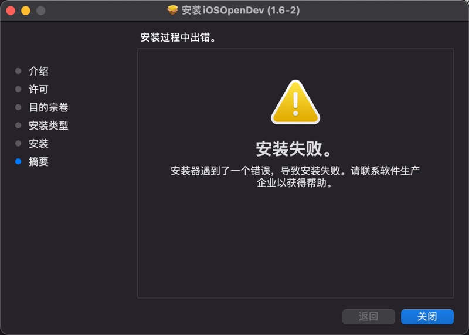
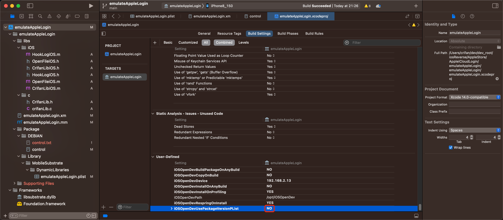
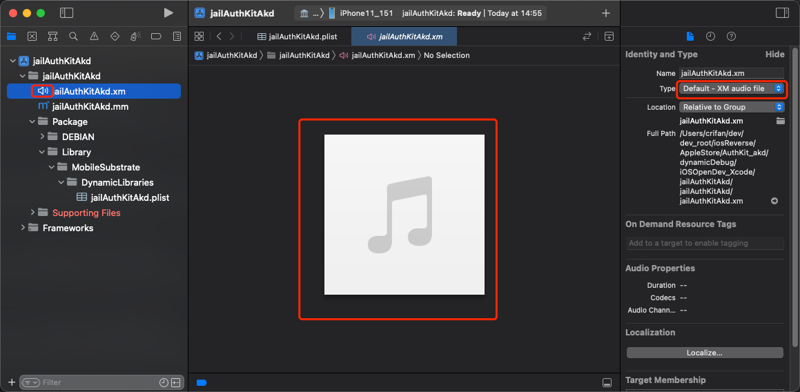

# 常见问题

## 安装器遇到了一个错误，导致安装失败

安装到最后，报错：`安装失败 安装器遇到了一个错误，导致安装失败`



解决办法：

其实此时`iOSOpenDev`的主体文件已安装到了默认的位置`/opt`中，接着去用工具初始化即可解决问题：

```bash
cd /opt/iOSOpenDevSetup/bin
sudo ./iod-setup base
sudo ./iod-setup sdk -sdk iphoneos
```

## PrivateFramework directory not found XCode iPhoneOS15.0.sdk

`iod-setup sdk -sdk iphoneos`时报错：

```bash
➜  bin sudo ./iod-setup sdk -sdk iphoneos
Setting up iPhoneOS 15.0 SDK...
Modifying SDK settings...
Symlinking to private frameworks header files...
PrivateFramework directory not found: /Applications/Xcode.app/Contents/Developer/Platforms/iPhoneOS.platform/Developer/SDKs/iPhoneOS15.0.sdk/System/Library/PrivateFrameworks
```

原因：

此处是比较新的`XCode 13`和对应的`iOS 15`

->而最新版XCode和iOS早已将私有库PrivateFrameworks移走了

->即`iPhoneOSxx.xx.sdk/System/Library/`下面没有`PrivateFrameworks`了

解决办法：

* 自己之后是否用到私有库PrivateFrameworks
  * 否
    * 直接新建一个空目录即可
      ```bash
      cd /Applications/Xcode.app/Contents/Developer/Platforms/iPhoneOS.platform/Developer/SDKs/iPhoneOS15.0.sdk/System/Library
      sudo mkdir PrivateFrameworks
      ```
  * 是
    * 除了新建目录外，还要把相关iPhoneOS版本的私有库的内容放过去
      * 先要找到相关iPhoneOS的PrivateFrameworks
        * 举例
          * `iPhoneOS 9.2`的`sdk`，可以从这里下载到：
            * [zhangkn/knPrivateFrameworks: /Applications/Xcode.app/Contents/Developer/Platforms/iPhoneOS.platform/Developer/SDKs/iPhoneOS9.2.sdk/System/Library/PrivateFrameworks (github.com)](https://github.com/zhangkn/knPrivateFrameworks)

## File not found XCode Specifications iPhoneOSPackageTypes.xcspec

`iod-setup sdk -sdk iphoneos`报错：

```bash
➜  bin sudo ./iod-setup sdk -sdk iphoneos
Password:
Setting up iPhoneOS 15.0 SDK...
Modifying SDK settings...
Symlinking to private frameworks header files...
Adding specifications to platform...
File not found: /Applications/Xcode.app/Contents/Developer/Platforms/iPhoneOS.platform/Developer/Library/Xcode/Specifications/iPhoneOSPackageTypes.xcspec
```

原因：

找不到specifications

解决办法：

下载别人给的：

* 4个iPhoneOS的spec文件
* 4个iPhoneSimulator的spec文件

分别放到对应位置，即可。

下载来源：

* 来源1：
  * [iosopendev专用Specifications.zip](https://www.ianisme.com/download/201605/iosopendev%E4%B8%93%E7%94%A8Specifications.zip)
* 来源2：
  * [越狱开发:用iosOpenDev配置越狱开发环境 编写第一个hello world_我的杯洗具的博客-CSDN博客](http://blog.csdn.net/u013583789/article/details/50396747)

下载后，可以看到Specifications中有8个spec。

分别新建Specifications目录：

```bash
sudo mkdir /Applications/Xcode.app/Contents/Developer/Platforms/iPhoneOS.platform/Developer/Library/Xcode/Specifications
sudo mkdir /Applications/Xcode.app/Contents/Developer/Platforms/iPhoneSimulator.platform/Developer/Library/Xcode/Specifications
```

再去

* 移动文件
  * 把
    * 4个`iPhoneOS`的文件
      * iPhoneOSPackageTypes.xcspec
      * iPhoneOSPackageTypes.xcspec.iOSOpenDev
      * iPhoneOSProductTypes.xcspec
      * iPhoneOSProductTypes.xcspec.iOSOpenDev
    * 放到：
      * /Applications/Xcode.app/Contents/Developer/Platforms/iPhoneOS.platform/Developer/Library/Xcode/Specifications
  * 把：
    * 4个`iPhoneSimulator`的文件
      * iPhone Simulator PackageTypes.xcspec
      * iPhone Simulator PackageTypes.xcspec.iOSOpenDev
      * iPhone Simulator ProductTypes.xcspec
      * iPhone Simulator ProductTypes.xcspec.iOSOpenDev
    * 放到：
      * /Applications/Xcode.app/Contents/Developer/Platforms/iPhoneSimulator.platform/Developer/Library/Xcode/Specifications

放好后是：

```bash
➜  Xcode ll /Applications/Xcode.app/Contents/Developer/Platforms/iPhoneOS.platform/Developer/Library/Xcode/Specifications
total 48
-rwxr-xr-x@ 1 crifan  wheel   3.2K 12 24  2015 iPhoneOSPackageTypes.xcspec
-rwxr-xr-x@ 1 crifan  wheel   5.4K 12 24  2015 iPhoneOSPackageTypes.xcspec.iOSOpenDev
-rwxr-xr-x@ 1 crifan  wheel   4.0K 12 24  2015 iPhoneOSProductTypes.xcspec
-rwxr-xr-x@ 1 crifan  wheel   6.4K 12 24  2015 iPhoneOSProductTypes.xcspec.iOSOpenDev
➜  Xcode ll /Applications/Xcode.app/Contents/Developer/Platforms/iPhoneSimulator.platform/Developer/Library/Xcode/Specifications
total 48
-rwxr-xr-x@ 1 crifan  wheel   3.4K 12 24  2015 iPhone Simulator PackageTypes.xcspec
-rwxr-xr-x@ 1 crifan  wheel   6.9K 12 24  2015 iPhone Simulator PackageTypes.xcspec.iOSOpenDev
-rwxr-xr-x@ 1 crifan  wheel   3.4K 12 24  2015 iPhone Simulator ProductTypes.xcspec
-rwxr-xr-x@ 1 crifan  wheel   6.1K 12 24  2015 iPhone Simulator ProductTypes.xcspec.iOSOpenDev
```

另外，新建usr的bin目录：

```bash
sudo mkdir /Applications/Xcode.app/Contents/Developer/Platforms/iPhoneSimulator.platform/Developer/usr/bin
```

即可。

## Host key verification failed

* 现象：

Xcode编译期间报错：

```bash
Preparing to run Xcode Build Phase...
Signing /Users/crifan/Library/Developer/Xcode/DerivedData/iOSBypassJailbreak-bfqgivvncccwmeaykhtbtvgylkkq/Build/Products/Release-iphoneos/iOSBypassJailbreak.dylib with ldid... Done.
Copying /Users/crifan/Library/Developer/Xcode/DerivedData/iOSBypassJailbreak-bfqgivvncccwmeaykhtbtvgylkkq/Build/Products/Release-iphoneos/iOSBypassJailbreak.dylib to package directory at /Users/crifan/dev/dev_root/crifan/iOSBypassJailbreak/iOSBypassJailbreak/Package/Library/MobileSubstrate/DynamicLibraries...
Preparing to build package...
Setting control file /Users/crifan/dev/dev_root/crifan/iOSBypassJailbreak/iOSBypassJailbreak/Package/DEBIAN/control Version field to 1.0-1 using /Users/crifan/dev/dev_root/crifan/iOSBypassJailbreak/iOSBypassJailbreak/PackageVersion.plist... Done.
Building package ... Done.
Creating zip /Users/crifan/dev/dev_root/crifan/iOSBypassJailbreak/Packages/com.crifan.iOSBypassJailbreak_1.0-1_iphoneos-arm.zip... Done.
Host key verification failed.
Failed to create directory /var/root/iOSOpenDevPackages on device 192.168.1.27
Command PhaseScriptExecution failed with a nonzero exit code
```

* 原因：没有ssh免密登录
* 解决办法：设置好[ssh免密登录](../normal_tweak_process/ssh_no_pwd_login.md)

## control的Version版本号的改动会丢失

* 现象：

项目中的`.plist`中的`Version`的值，默认是`1.0-1`

当想要去改动版本号，比如改为`2023.07.19.2126`，结果重新编译后，改动后的Version值丢失，又恢复到之前的默认值`1.0-1`了

* 解决办法
  * `TARGETS`->`Build Settings`->`User-Defined`->`iOSOpenDevUsePackageVersionPList`从（默认的）`YES`改为`NO`
    * 

## `.xm`被识别为Audio音频文件

* 问题：`iOSOpenDev`的`Xcode`中，默认的`.xm`被识别成**音频**文件，无法显示对应的源代码
  * 具体现象
    * xm的文件的图标是`小喇叭`
    * 且右边显示的是：音乐的图标
    * 右边文件类型Type显示是：`Default - XM audio file`
  * 图
    * 
* 解决办法：
  * 先去：改变.xm的文件类型
    * Xcode右边的文件属性->`Type`，从`Default - XM audio file`改为`Objective-C++ Source`（或`Objective-C Source`）
      * 
  * 再去改变`.xm`的文件的打开方式
    * Xcode左边文件列表->右键`.xm`文件->`Open As`->`Source Code`
      * 
  * 即可正常显示`.xm`为ObjC的代码，并且带语法高亮了，且文件图标是`.m`的图标
    * 

## 安装插件后桌面上看不到iOS的app图标

* 现象：带UI界面的tweak或app，（通过Filza）安装到iPhone中后，桌面上看不到iOS的app的图标
* 原因：iPhone的UI界面没有刷新=icon图标没有刷新
* 解决办法：
  * 如果是通过Filza安装deb的话
    * Filza的安装完成界面的点击右上角：`动作` -> 选择：`UIcache`
      * 图
        * 
    * 稍等片刻-》桌面上即可出现iOS的app的logo图标了
      * 注：此时点击 `注销`=`Respring`=`重启SpringBoard`，虽然理论上可行，但实际是无效的，无法让桌面出现app图标的
  * 如果不是，则可以单独命令行去运行：`uicache`

## mach-o file, but is an incompatible architecture have 'arm64', need 'arm64e'

* 现象

iOSOpenDev的Xcode编译出了插件dylib插件，但是启动加载时报错：

```bash
'/private/preboot/xxx/procursus/Library/MobileSubstrate/DynamicLibraries/jailAppleAccount.dylib' (mach-o file, but is an incompatible architecture (have 'arm64', need 'arm64e'))
```


* 原因：此处目标设备`iPhone11`的`CPU`是`A12`，其架构是`arm64e`的，而插件代码编译出的架构是针对`arm64`的，不兼容，所以报错

* 解决办法：
  * Xcode中去把架构改为（包含=支持）`arm64e`
* 具体步骤：
  * `Xcode`->`TARGETS`->`YourProjectName`->`Build Settings`->`Architectures`->`Architectures`
    * 从默认的：`$(ARCHS_STANDARD)`==`arm64, armv7`
    * 改为：`Other`的`arm64 arm64e`

如此，即可确认所编译出来的代码（插件），支持arm64e了。

注：

* 如果额外引用到库文件，则也要确保库文件是支持此处的arm64e的
  * 比如此处遇到`libsubstrate.dylib`，就是：
    * 默认（iOSOpenDev自带的）不支持arm64e，最后是另外找支持arm64e的
      * 比如
        * XinaA15越狱后的iPhone11中有
          * `/private/preboot/3B92D6F7C3FE6444A715B312E418498574E442DAB2F6D9E18B58B762F71D1455B7E2E1C2DD3912B1B4E6D10C6B9150C8/procursus/usr/lib/libsubstrate.dylib`
            * 大小：218KB
            * (就是我们要的)FAT格式的，支持2种架构：`arm64`和`arm64e`
    * 去拷贝替换掉原先的：`Mac`中的`/opt/iOSOpenDev/lib/libsubstrate.dylib`
    * 才顺利编译和链接，才能确保插件正常工作
