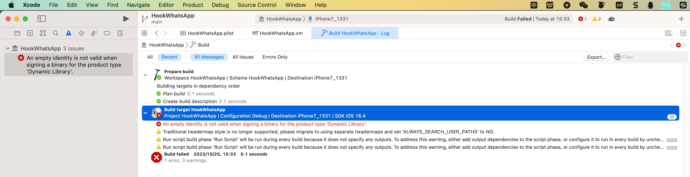
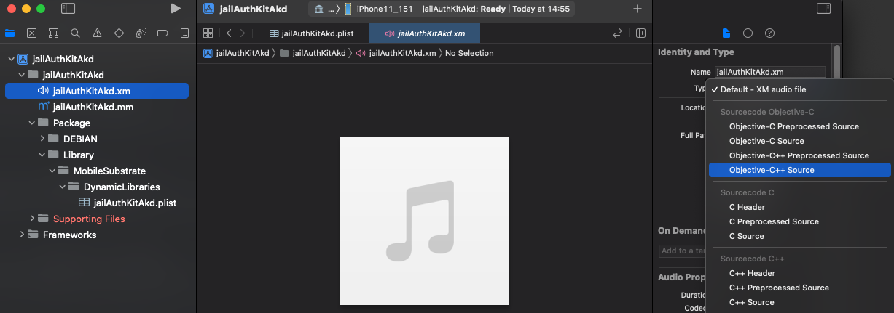

# 编译调试方面的问题

## An empty identity is not valid when signing a binary for the product type 'Dynamic Library'

* 现象

`M2 Max Mac` + `Xcode 14.3.1`中，新建iOSOpenDev项目，去Build编译，报错：

```bash
An empty identity is not valid when signing a binary for the product type 'Dynamic Library'
```

拷贝出的详细错误信息：

```bash
Build target HookWhatsApp of project HookWhatsApp with configuration Debug
error: An empty identity is not valid when signing a binary for the product type 'Dynamic Library'. (in target 'HookWhatsApp' from project 'HookWhatsApp')
warning: Traditional headermap style is no longer supported; please migrate to using separate headermaps and set 'ALWAYS_SEARCH_USER_PATHS' to NO. (in target 'HookWhatsApp' from project 'HookWhatsApp')
warning: Run script build phase 'Run Script' will be run during every build because it does not specify any outputs. To address this warning, either add output dependencies to the script phase, or configure it to run in every build by unchecking "Based on dependency analysis" in the script phase. (in target 'HookWhatsApp' from project 'HookWhatsApp')
warning: Run script build phase 'Run Script' will be run during every build because it does not specify any outputs. To address this warning, either add output dependencies to the script phase, or configure it to run in every build by unchecking "Based on dependency analysis" in the script phase. (in target 'HookWhatsApp' from project 'HookWhatsApp')

An empty identity is not valid when signing a binary for the product type 'Dynamic Library'.
```



* 原因：不是很清楚
  * 只是大概知道，属于Xcode的自动管理codesign签名方面的问题
* 解决办法：禁用自动签名
* 具体步骤：`Xcode`->`Project`->`{YourProjectName}`->`Build Settings`->`User-Defined`->
  * (点击左上角的`加号`=`➕`->`Add User-Defined Setting`)
    * 
  * 新增选项:`CODE_SIGNING_ALLOWED`=`NO`
    * 
  * 额外说明
    * 如果还不行，多试几次Clean：
      * `Xcode`->`Product`->`Clean Build Folders`
      * `Xcode`->`Product`->`Clean All Issues`

## control的Version版本号的改动会丢失

* 现象：

项目中的`.plist`中的`Version`的值，默认是`1.0-1`

当想要去改动版本号，比如改为`2023.07.19.2126`，结果重新编译后，改动后的Version值丢失，又恢复到之前的默认值`1.0-1`了

* 解决办法
  * `TARGETS`->`Build Settings`->`User-Defined`->`iOSOpenDevUsePackageVersionPList`从（默认的）`YES`改为`NO`
    * 

## `.xm`被识别为Audio音频文件

* 问题：`iOSOpenDev`的`Xcode`中，默认的`.xm`被识别成**音频**文件，无法显示对应的源代码
  * 具体现象
    * xm的文件的图标是`小喇叭`
    * 且右边显示的是：音乐的图标
    * 右边文件类型Type显示是：`Default - XM audio file`
  * 图
    * 
* 解决办法：
  * 先去：改变.xm的文件类型
    * Xcode右边的文件属性->`Type`，从`Default - XM audio file`改为`Objective-C++ Source`（或`Objective-C Source`）
      * 
  * 再去改变`.xm`的文件的打开方式
    * Xcode左边文件列表->右键`.xm`文件->`Open As`->`Source Code`
      * 
  * 即可正常显示`.xm`为ObjC的代码，并且带语法高亮了，且文件图标是`.m`的图标
    * 

## 安装插件后桌面上看不到iOS的app图标

* 现象：带UI界面的tweak或app，（通过Filza）安装到iPhone中后，桌面上看不到iOS的app的图标
* 原因：iPhone的UI界面没有刷新=icon图标没有刷新
* 解决办法：
  * 如果是通过Filza安装deb的话
    * Filza的安装完成界面的点击右上角：`动作` -> 选择：`UIcache`
      * 图
        * 
    * 稍等片刻-》桌面上即可出现iOS的app的logo图标了
      * 注：此时点击 `注销`=`Respring`=`重启SpringBoard`，虽然理论上可行，但实际是无效的，无法让桌面出现app图标的
  * 如果不是，则可以单独命令行去运行：`uicache`

## mach-o file, but is an incompatible architecture have 'arm64', need 'arm64e'

* 现象

iOSOpenDev的Xcode编译出了插件dylib插件，但是启动加载时报错：

```bash
'/private/preboot/xxx/procursus/Library/MobileSubstrate/DynamicLibraries/jailAppleAccount.dylib' (mach-o file, but is an incompatible architecture (have 'arm64', need 'arm64e'))
```


* 原因：此处目标设备`iPhone11`的`CPU`是`A12`，其架构是`arm64e`的，而插件代码编译出的架构是针对`arm64`的，不兼容，所以报错

* 解决办法：
  * Xcode中去把架构改为（包含=支持）`arm64e`
* 具体步骤：
  * `Xcode`->`TARGETS`->`YourProjectName`->`Build Settings`->`Architectures`->`Architectures`
    * 从默认的：`$(ARCHS_STANDARD)`==`arm64, armv7`
    * 改为：`Other`的`arm64 arm64e`

如此，即可确认所编译出来的代码（插件），支持arm64e了。

注：

* 如果额外引用到库文件，则也要确保库文件是支持此处的arm64e的
  * 比如此处遇到`libsubstrate.dylib`，就是：
    * 默认（iOSOpenDev自带的）不支持arm64e，最后是另外找支持arm64e的
      * 比如
        * XinaA15越狱后的iPhone11中有
          * `/private/preboot/3B92D6F7C3FE6444A715B312E418498574E442DAB2F6D9E18B58B762F71D1455B7E2E1C2DD3912B1B4E6D10C6B9150C8/procursus/usr/lib/libsubstrate.dylib`
            * 大小：218KB
            * (就是我们要的)FAT格式的，支持2种架构：`arm64`和`arm64e`
    * 去拷贝替换掉原先的：`Mac`中的`/opt/iOSOpenDev/lib/libsubstrate.dylib`
    * 才顺利编译和链接，才能确保插件正常工作
