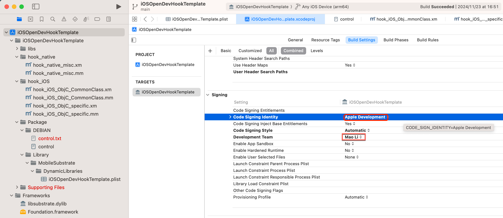

# An empty identity is not valid when signing a binary for the product type 'Dynamic Library'

## 现象

`M2 Max Mac` + `Xcode 14.3.1`中，新建iOSOpenDev项目，去Build编译，报错：

```bash
An empty identity is not valid when signing a binary for the product type 'Dynamic Library'
```

拷贝出的详细错误信息：

```bash
Build target HookWhatsApp of project HookWhatsApp with configuration Debug
error: An empty identity is not valid when signing a binary for the product type 'Dynamic Library'. (in target 'HookWhatsApp' from project 'HookWhatsApp')
...
An empty identity is not valid when signing a binary for the product type 'Dynamic Library'.
```


## 原因

* 不是很清楚
  * 只是大概知道，属于Xcode的自动管理codesign签名方面的问题

## 解决办法

* 思路1：禁用自动签名
* 思路2：给`identity`设置某个合适的值（这样就不是empty空了）

## 具体步骤

### 思路1：禁用自动签名

* `Xcode`->`Project`->`{YourProjectName}`->`Build Settings`->`User-Defined`->
  * (点击左上角的`加号`=`➕`->`Add User-Defined Setting`)
    * 
  * 新增选项:`CODE_SIGNING_ALLOWED`=`NO`
    * 
  * 额外说明
    * 如果还不行，多试几次Clean：
      * `Xcode`->`Product`->`Clean Build Folders`
      * `Xcode`->`Product`->`Clean All Issues`

### 思路2：给Identity设置某个合适的值

* `Xcode`->`Project`->`{YourProjectName}`->`Build Settings`->`Signing`->`Code Sign Identity`->设置为（`Automatic`中的）`Apple Development`
  * 

#### 不要设置Code Sign Identity为`Apple Development: xxx`

此处之前设置了：

* `Xcode`->`Project`->`{YourProjectName}`->`Build Settings`->`Signing`->`Code Sign Identity`->设置为（`Certificates in Keychain`中的）`Apple Development: Mao Li (UBFSP2P5PM)`
  * 

结果会报错：

```bash
/Users/crifan/dev/dev_root/crifan/github/iOSOpenDevHookTemplate/iOSOpenDevHookTemplate/iOSOpenDevHookTemplate.xcodeproj iOSOpenDevHookTemplate has conflicting provisioning settings. iOSOpenDevHookTemplate is automatically signed, but code signing identity Apple Development: Mao Li (UBFSP2P5PM) has been manually specified. Set the code signing identity value to "Apple Development" in the build settings editor, or switch to manual signing in the Signing & Capabilities editor.
```


然后改为上面说的（`Automatic`中的）`Apple Development`，才彻底解决了此处报错的问题。
