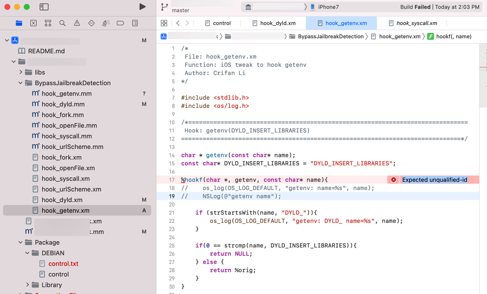
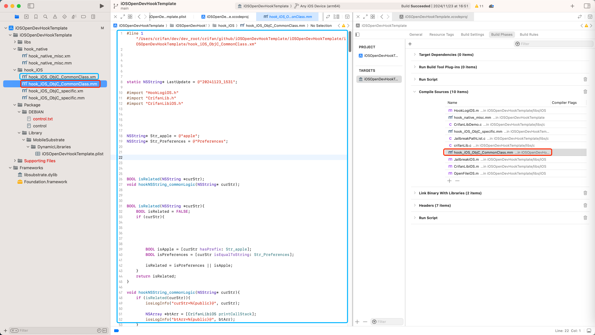

# `Compile Sources`中误添加了不支持的`.xm`

## 现象

iOSOpenDev中，新增`.xm`文件后，尝试去编译

结果代码：

```c
%hookf(char *, getenv, const char* name){
```

其中的`%hookf`，编译报错：

```bash
Expected unqualified-id
```



## 原因

### 直接原因

iOS的clang编译器无法识别（Logos的）语法：%hookf

### 根本原因

之前新增`.xm`文件时，无意间，不知道是哪里不小心，（把）导致了`.xm`，被加到了Xcode（+iOSOpenDev）中的`Compile Sources`中了

而此处，iOSOpenDev的最终的所支持的代码逻辑对应的源代码文件的格式：

* 不支持：`.xm`
* 只支持：`.mm`

而此处，背后的`.xm`和`.mm`的逻辑，详见：

[.xm和.mm文件的逻辑](../../normal_tweak_process/write_code/xm_mm_logic.md)

## 解决办法

1. 去`Compile Sources`中，把`.xm`文件移除掉
2. Xcode重新编译`Build`
  * 目的：从`.xm`中编译生成对应的`.mm`文件
3. 再去把新生成的`.mm`文件，加到`Compile Sources`中，即可正常编译

## 具体步骤

`Xcode`->`Targets`->`Build Phases`->`Compile Sources`

如果有`.xm`文件：则（点击`➖`）去删除掉

再去`Xcode`->`Build`：


对于新增的`.xm`文件，则会生成新的对应的`.mm`文件

然后再去：

`Xcode`->项目主目录->右键->`Add Files to ...` -> 选择新生成的对应的`.mm`文件，且勾选：`Copy items if needed`->`Add`，即可把`.mm`加到项目中

最后：`Xcode`->`Targets`->`Build Phases`->`Compile Sources`

只保留正常的`.mm`文件（和其他的`.c`、`.m`等文件）：


