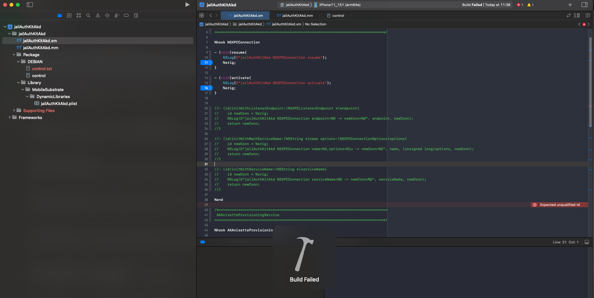
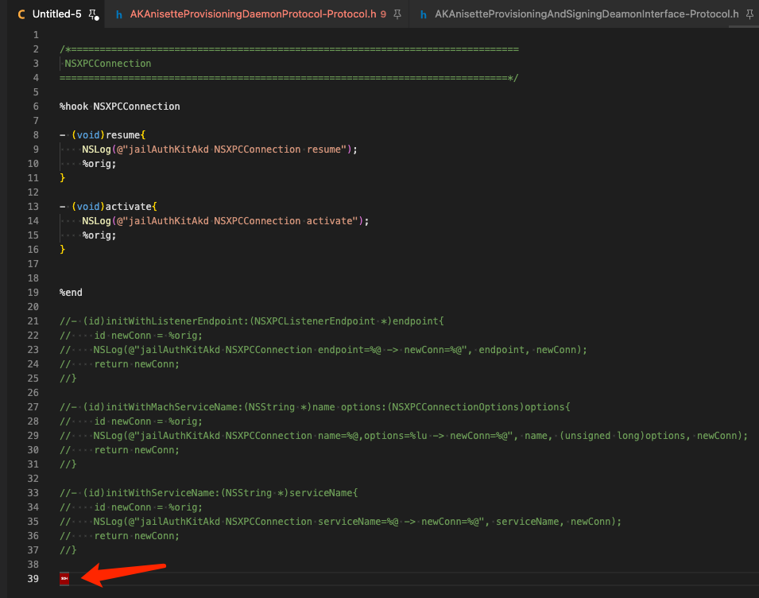
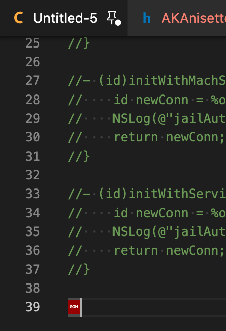
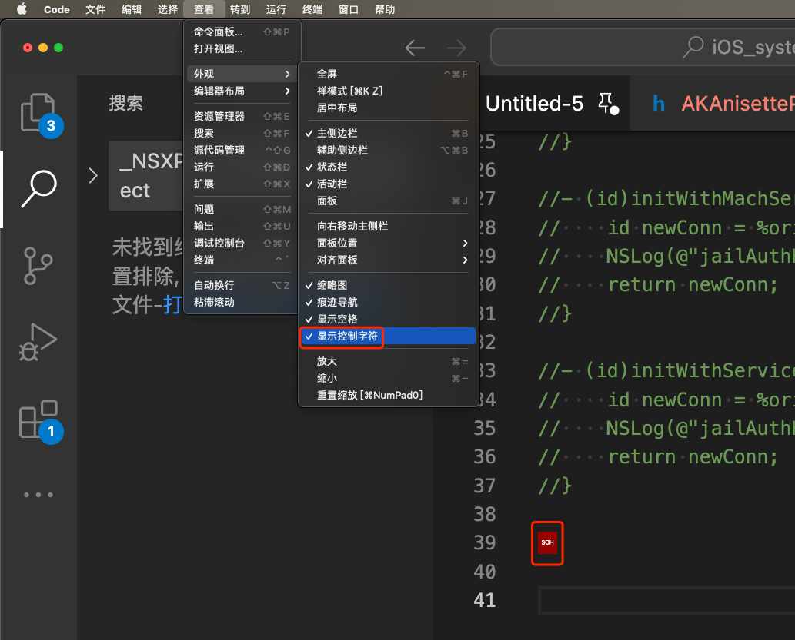

# 无法识别的特殊字符

## 现象

iOSOpenDev的`.xm`文件编译报错：

```bash
Expected unqualified-id
```



## 原因

此处（由于之前某些操作，比如从别处复制粘贴过来一些内容，而导致的）`.xm`源码中，有，此处不支持的，特殊的，控制字符

此处Xcode源码编译器中：无法看到此（不可见的）特殊字符

可以换用VSCode去打开查看到，特殊的，控制字符：



放大显示效果，可以看到此处特殊字符=控制字符=不可见字符，是：`SOH`==`Start of Header`==`标题开始`



* 注：
  * 关于特殊的、不可见的、控制字符的细节，详见：[字符编码详解](https://www.crifan.org/files/doc/docbook/char_encoding/release/html/char_encoding.html#ascii_ctrl_char)

## 解决办法

（借助于VSCode，在能看到）此特殊的不可见的控制字符（的前提下），去删除掉

## 具体步骤

复制Xcode中的代码，粘贴到VSCode中

然后：VSCode-》查看-》外观-》显示控制字符-》找到对应不支持的特殊的控制字符，去删除即可



注：

* 关于VSCode支持显示不可见的控制字符，详见：[代码编辑器常用功能 · 史上最好用的编辑器：VSCode](https://book.crifan.org/books/best_editor_vscode/website/editor_common_functions/)
