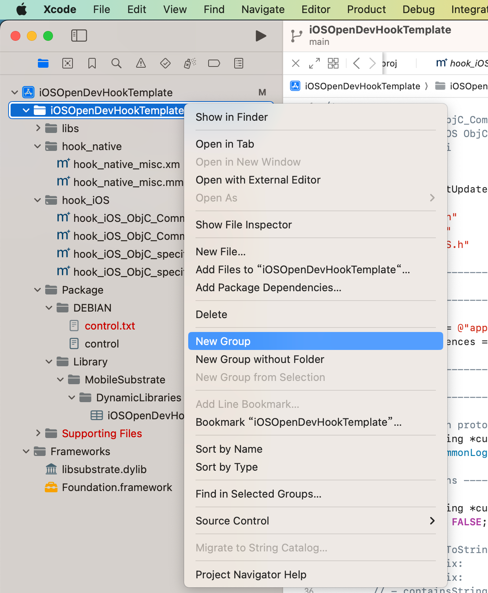
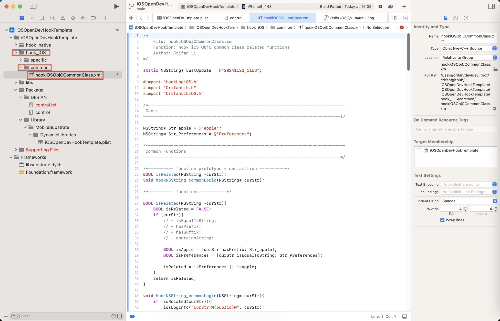
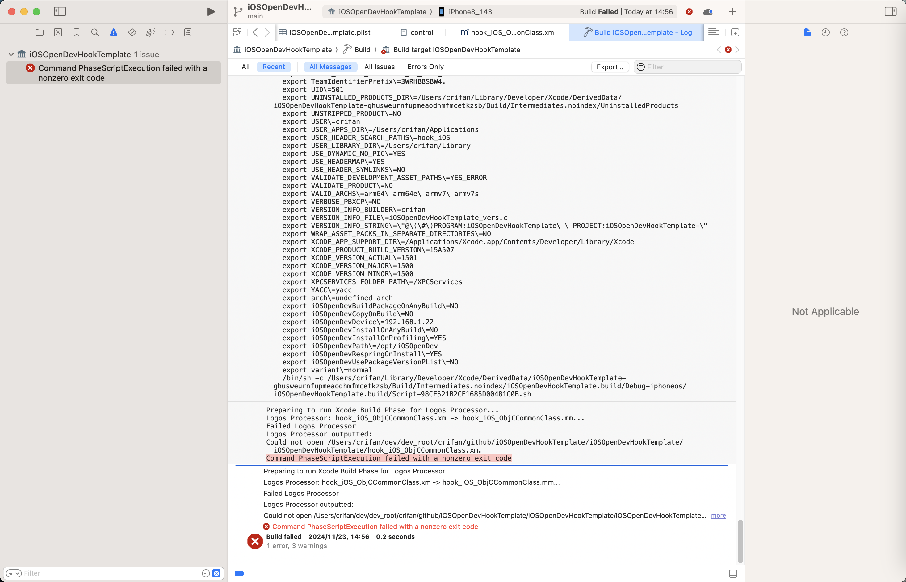
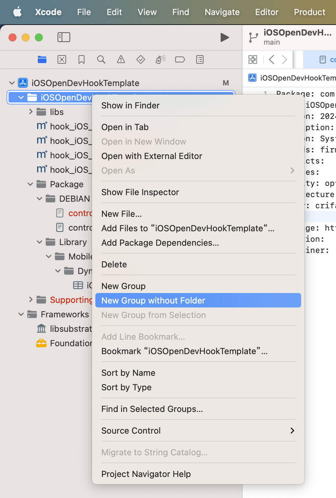
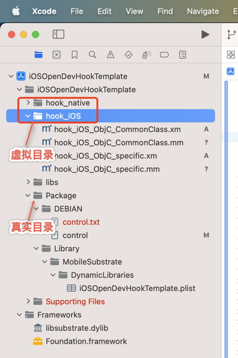
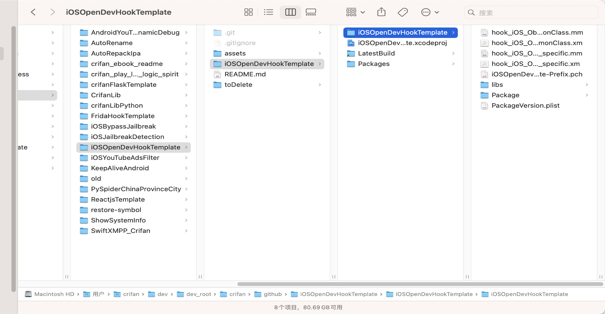

# Failed Logos Processor outputted Could not open xm file

## 现象

之前iOSOpenDev中，主项目目录下面，新建**子目录**：

* 

在子目录中，新增`.xm`文件：

* iOSOpenDevHookTemplate
  * hook_iOS
    * common
      * hook_iOS_ObjCCommonClass.xm

* 

会导致编译报错：

```bash
Preparing to run Xcode Build Phase for Logos Processor...
Logos Processor: hook_iOS_ObjCCommonClass.xm -> hook_iOS_ObjCCommonClass.mm...
Failed Logos Processor
Logos Processor outputted:
Could not open /Users/crifan/dev/dev_root/crifan/github/iOSOpenDevHookTemplate/iOSOpenDevHookTemplate/iOSOpenDevHookTemplate/hook_iOS_ObjCCommonClass.xm.
Command PhaseScriptExecution failed with a nonzero exit code
```

* 

## 原因

（看来是）iOSOpenDev中，不支持子目录 == 如果把`.xm`放在子目录中，则`Logos Processor`则会找不到，导致编译报错

## 解决办法

### 【推荐】思路1：用虚拟目录

Xcode中，右键新建目录时：

* 不用：`New Group`
  * -> 创建物理上的，文件系统上，真实的：子目录
* 改用：`New Group without folder`
  * -> Xcode中虚拟的子目录 = 物理上的，文件系统上的子目录：是没有的，是不存在的

* 

#### 效果

（1）Xcode中文件夹图标

虚拟文件夹 和 真实文件夹：图标，略有不同：

* 文件夹左下角的小三角
  * 虚拟文件夹：有
  * 真实文件夹：没有

* 

（2）Xcode中虚拟的子目录 = 物理上的，文件系统上的子目录：是没有的，是不存在的

Finder中，是看不到（Xcode中的虚拟的）子目录的：

* 

### 【不推荐】思路2：放弃创建子目录

Xcode中的iOSOpenDev中，新增文件时：不用`New Group`，即：

只能把所有`.xm`（和对应的`.mm`文件，都直接放到根目录下，没有子目录了

-》虽然当文件多时，逻辑上不够清晰，但是至少能凑合用
