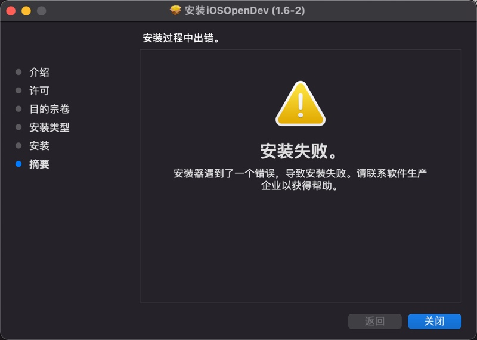

# 安装器遇到了一个错误，导致安装失败

安装到最后，报错：`安装失败 安装器遇到了一个错误，导致安装失败`



解决办法：

其实此时`iOSOpenDev`的主体文件已安装到了默认的位置`/opt`中，接着去用工具初始化即可解决问题：

```bash
cd /opt/iOSOpenDevSetup/bin
sudo ./iod-setup base
sudo ./iod-setup sdk -sdk iphoneos
```
