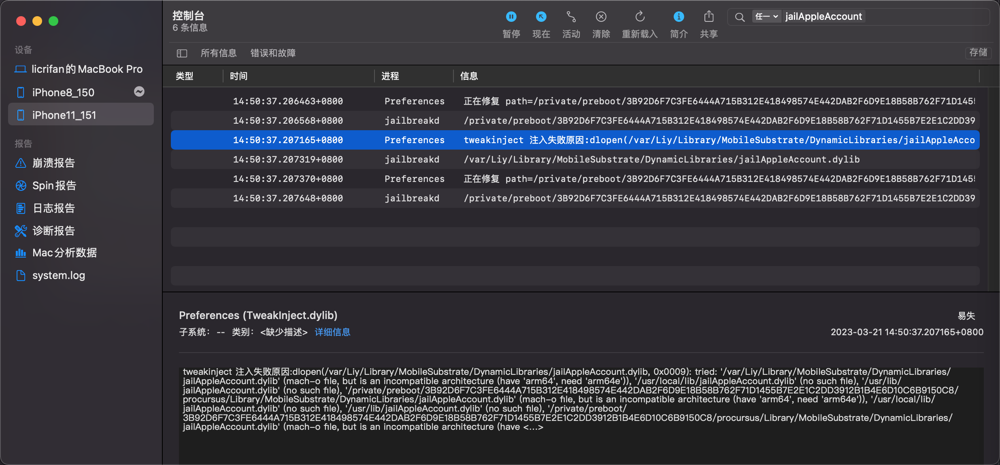

# mach-o file, but is an incompatible architecture have 'arm64', need 'arm64e'

## 现象

iOSOpenDev的Xcode编译出了插件dylib插件，但是启动加载时报错：

```bash
'/private/preboot/xxx/procursus/Library/MobileSubstrate/DynamicLibraries/jailAppleAccount.dylib' (mach-o file, but is an incompatible architecture (have 'arm64', need 'arm64e'))
```



## 原因

此处目标设备`iPhone11`的`CPU`是`A12`，其架构是`arm64e`的，而插件代码编译出的架构是针对`arm64`的，不兼容，所以报错

## 解决办法

* Xcode中去把架构改为（包含=支持）`arm64e`

## 具体步骤

* `Xcode`->`TARGETS`->`YourProjectName`->`Build Settings`->`Architectures`->`Architectures`
  * 从默认的：`$(ARCHS_STANDARD)`==`arm64, armv7`
  * 改为：`Other`的`arm64 arm64e`

如此，即可确认所编译出来的代码（插件），支持arm64e了。

## 注

* 如果额外引用到库文件，则也要确保库文件是支持此处的arm64e的
  * 比如此处遇到`libsubstrate.dylib`，就是：
    * 默认（iOSOpenDev自带的）不支持arm64e，最后是另外找支持arm64e的
      * 比如
        * XinaA15越狱后的iPhone11中有
          * `/private/preboot/3B92D6F7C3FE6444A715B312E418498574E442DAB2F6D9E18B58B762F71D1455B7E2E1C2DD3912B1B4E6D10C6B9150C8/procursus/usr/lib/libsubstrate.dylib`
            * 大小：218KB
            * (就是我们要的)FAT格式的，支持2种架构：`arm64`和`arm64e`
    * 去拷贝替换掉原先的：`Mac`中的`/opt/iOSOpenDev/lib/libsubstrate.dylib`
    * 才顺利编译和链接，才能确保插件正常工作
