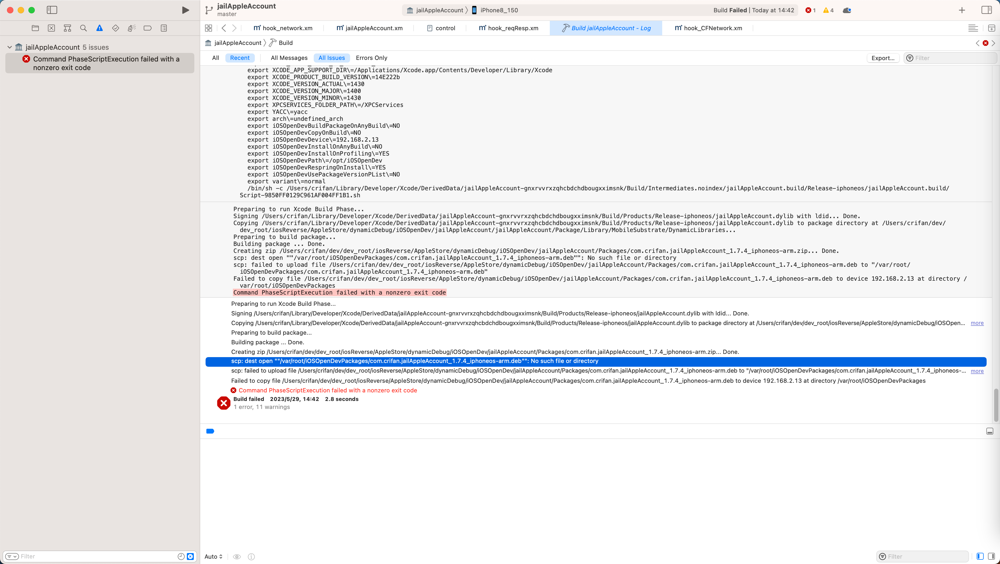

# scp: dest open ""/var/root/iOSOpenDevPackages/xxx.deb"": No such file or directory

## 现象
* Mac M2 Max中，用iOSOpenDev去编译deb插件到iPhone8，结果报错：
  * 

```bash
Creating zip /Users/crifan/dev/dev_root/iosReverse/AppleStore/dynamicDebug/iOSOpenDev/jailAppleAccount/Packages/com.crifan.jailAppleAccount_1.7.4_iphoneos-arm.zip... Done.
scp: dest open ""/var/root/iOSOpenDevPackages/com.crifan.jailAppleAccount_1.7.4_iphoneos-arm.deb"": No such file or directory
scp: failed to upload file /Users/crifan/dev/dev_root/iosReverse/AppleStore/dynamicDebug/iOSOpenDev/jailAppleAccount/Packages/com.crifan.jailAppleAccount_1.7.4_iphoneos-arm.deb to "/var/root/iOSOpenDevPackages/com.crifan.jailAppleAccount_1.7.4_iphoneos-arm.deb"
Failed to copy file /Users/crifan/dev/dev_root/iosReverse/AppleStore/dynamicDebug/iOSOpenDev/jailAppleAccount/Packages/com.crifan.jailAppleAccount_1.7.4_iphoneos-arm.deb to device 192.168.2.13 at directory /var/root/iOSOpenDevPackages
Command PhaseScriptExecution failed with a nonzero exit code
```

作为对比：

旧的Mac（Intel的Mac），则没遇到这个错误。

对应细节是：

* 旧Mac：正常编译
  * 之前的Xcode版本：`v13.2.1`
  * scp：`3MB`
    * FAT格式，支持`x86_64`和`arm64e`
* 新Mac：会报错
  * 错误信息：`scp: dest open ""/var/root/iOSOpenDevPackages/xxx.deb"": No such file or directory`
  * 最新Xcode版本：`v14.3`
  * scp：`416KB`
    * FAT格式，支持`x86_64`和`arm64e`

## 原因

iOSOpenDev插件编译后安装deb期间，底层过程是对应脚本控制的

* `/opt/iOSOpenDev/bin/iosod`

其底层负责此处拷贝的命令是：

```sh
function copyFileToDevice() # args: sourceFile, targetDir, hostAddress, hostPort
{
  ...
  scp -P$hostPort "$sourceFile" root@$hostAddress:"\"$targetFilePath\"" || \
```

而报错的原因，估计是：

新版Mac的CPU是ARM的Apple Silcon，对应的很多二进制，也是arm版本的

对应的scp，估计也是arm版本，其和旧的X86的scp，估计不太一样？

导致对于此处 scp中，带双引号的路径和文件，支持不够好，无法识别，所以报错找不到文件

## 解决办法

* 去掉scp命令中的（文件和目录中的）双引号

## 具体步骤

把 `/opt/iOSOpenDev/bin/iosod` 中的：

```sh
  scp -P$hostPort "$sourceFile" root@$hostAddress:"\"$targetFilePath\"" || \
```

改为：

```sh
  scp -P$hostPort $sourceFile root@$hostAddress:$targetFilePath || \
```
