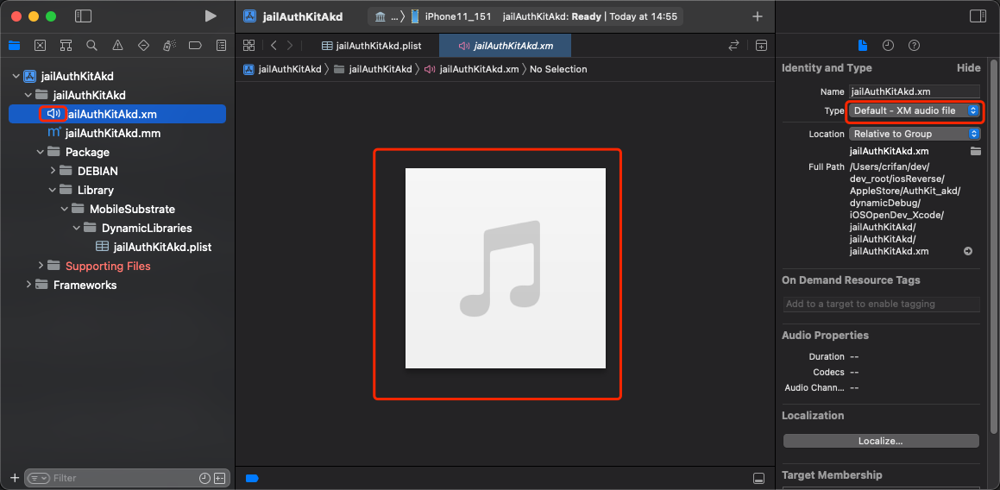
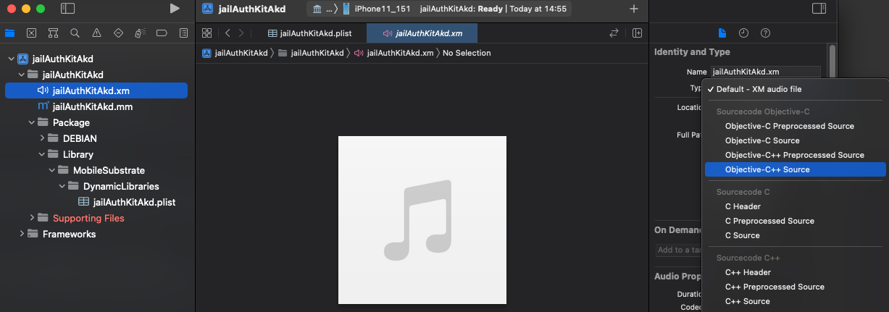
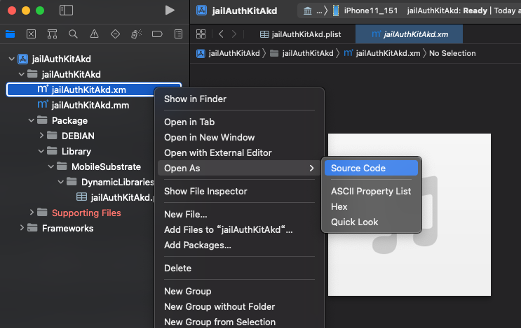
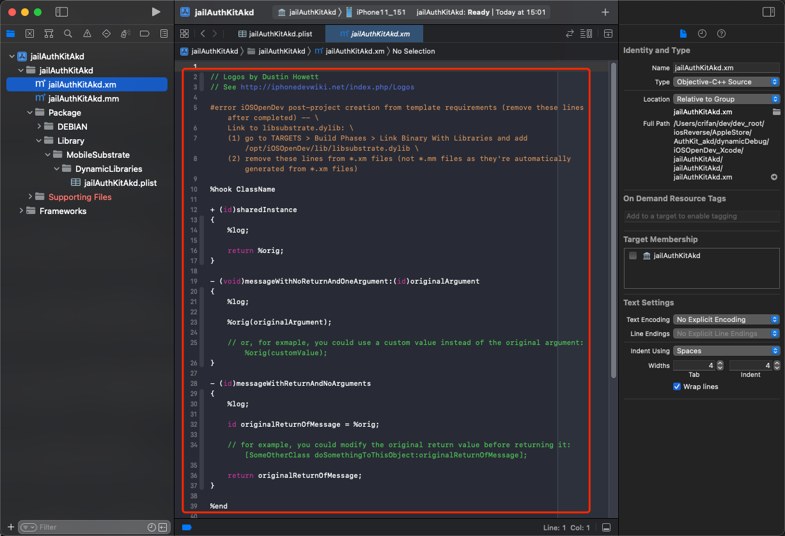

# `.xm`被识别为Audio音频文件

* 问题：`iOSOpenDev`的`Xcode`中，默认的`.xm`被识别成**音频**文件，无法显示对应的源代码
  * 具体现象
    * xm的文件的图标是`小喇叭`
    * 且右边显示的是：音乐的图标
    * 右边文件类型Type显示是：`Default - XM audio file`
  * 图
    * 
* 解决办法：
  * 先去：改变.xm的文件类型
    * Xcode右边的文件属性->`Type`，从`Default - XM audio file`改为`Objective-C++ Source`（或`Objective-C Source`）
      * 
  * 再去改变`.xm`的文件的打开方式
    * Xcode左边文件列表->右键`.xm`文件->`Open As`->`Source Code`
      * 
  * 即可正常显示`.xm`为ObjC的代码，并且带语法高亮了，且文件图标是`.m`的图标
    * 

* `.xm`文件，默认会被`Xcode`识别为`音频文件`
