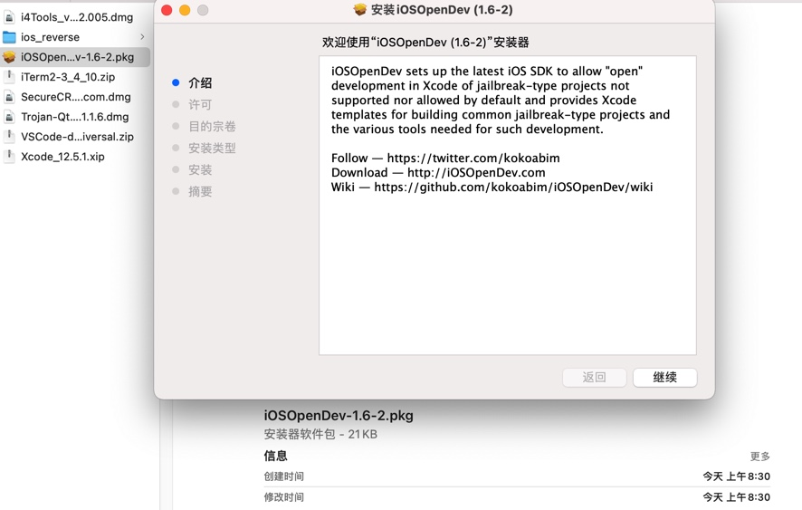
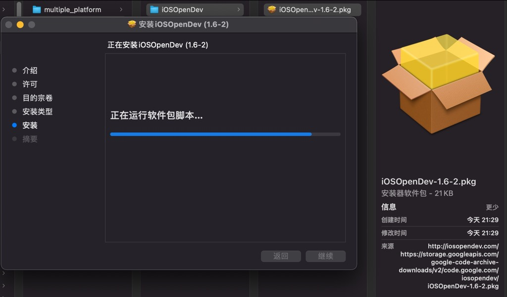
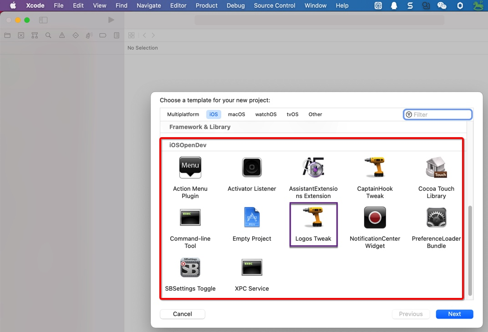

# 安装iOSOpenDev

从官网[iOSOpenDev—Download](http://iosopendev.com/download/)下载到：[iOSOpenDev-1.6-2.pkg](https://storage.googleapis.com/google-code-archive-downloads/v2/code.google.com/iosopendev/iOSOpenDev-1.6-2.pkg)，双击去安装：

成功安装后，去`Xcode`中新建`iOS`项目，即可看到`iOSOpenDev`的的选项：

