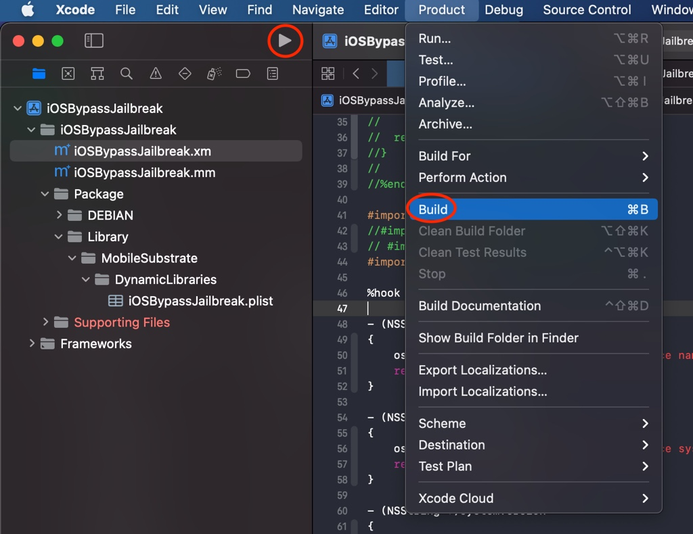
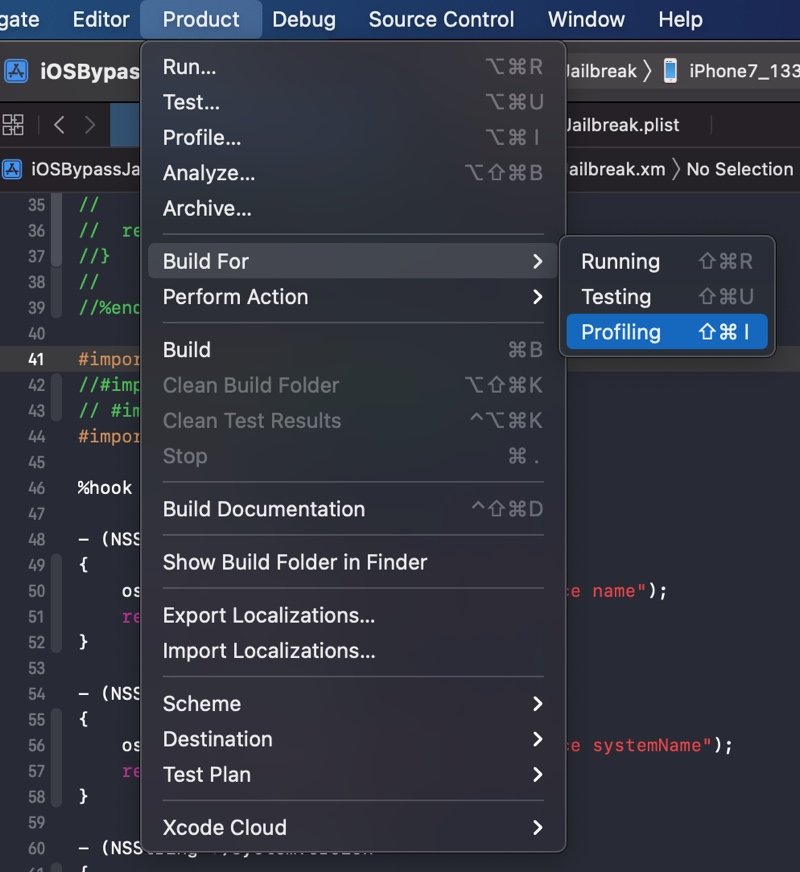
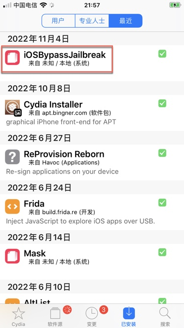
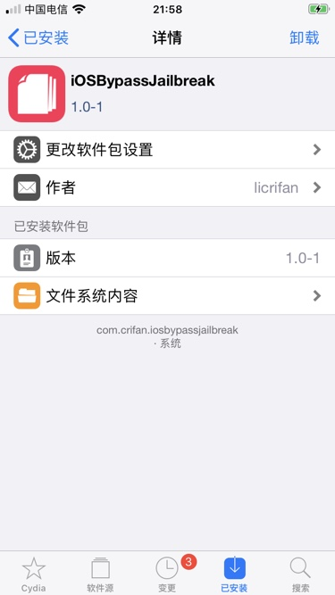
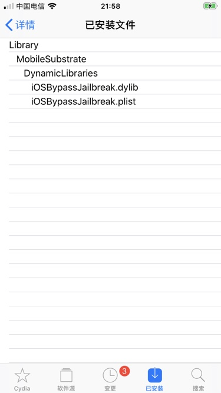
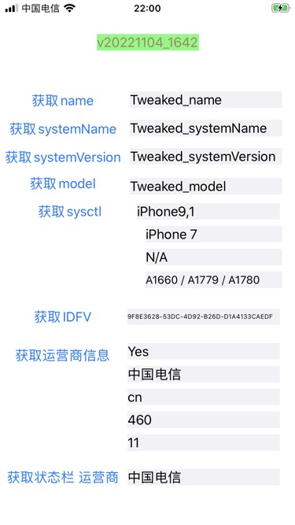
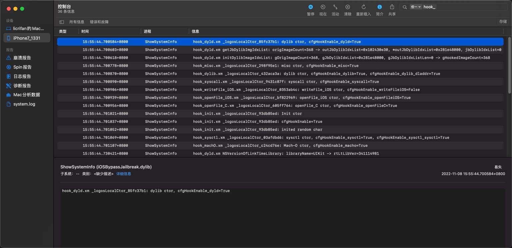

# 调试插件代码

接下来就是典型的插件开发流程了：

* **写代码** = 写hook代码= 写tweak插件代码 = 改动`.xm`文件
* **编译**代码 -》 确保语法没错，可以正常编译
  * `Xcode`->`Product`->`Build`
    * 
* **调试和运行** -》 把hook插件代码编译所生成的插件(`.deb`文件)安装到iOS设备(iPhone)中，测试插件效果
  * `Product`->`Build For`->`Profiling`
    * 

## 确认插件安装成功

* iPhone中看到自己的插件
  * `Cydia`->`已安装`->`最近` 能看到自己的插件：
    * 
  * 点击插件，可以看到插件基本信息
    * 
  * 点击插件的文件，可以看到文件列表
    * 

## 确认插件的确正常工作

* 打开被测试的=被hook的app，看到此处测试代码：更改信息信息，显示是我们hook代码中的值，表示hook成功
  * 
* 查看对应log日志
  * `Xcode`->`Window`->`Devices and Simulators`->`Devices`->选中`Connected`中自己的iPhone设备->`Open Console`->打开`Console`=`控制台`，显示出对应iPhone的log日志
    * 其中就有你的插件的log日志
      * 如果没有，则自己去右上角，搜索对应关键字，即可搜到
    * 此处贴出，后续更新了代码后的相关log
      * 
