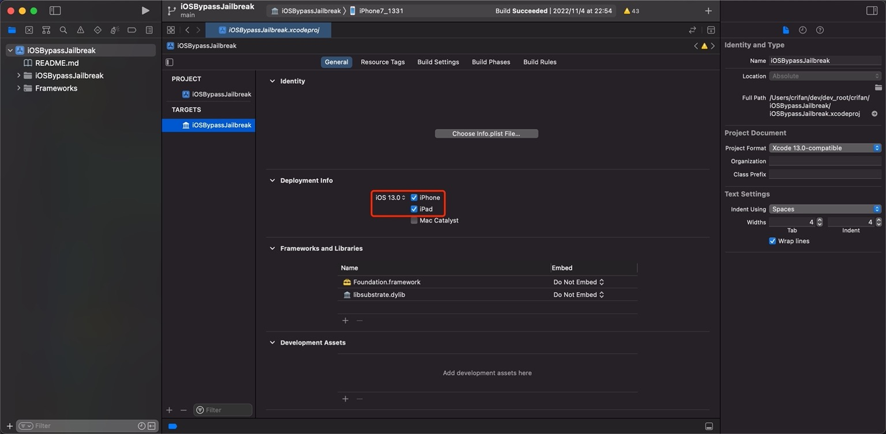
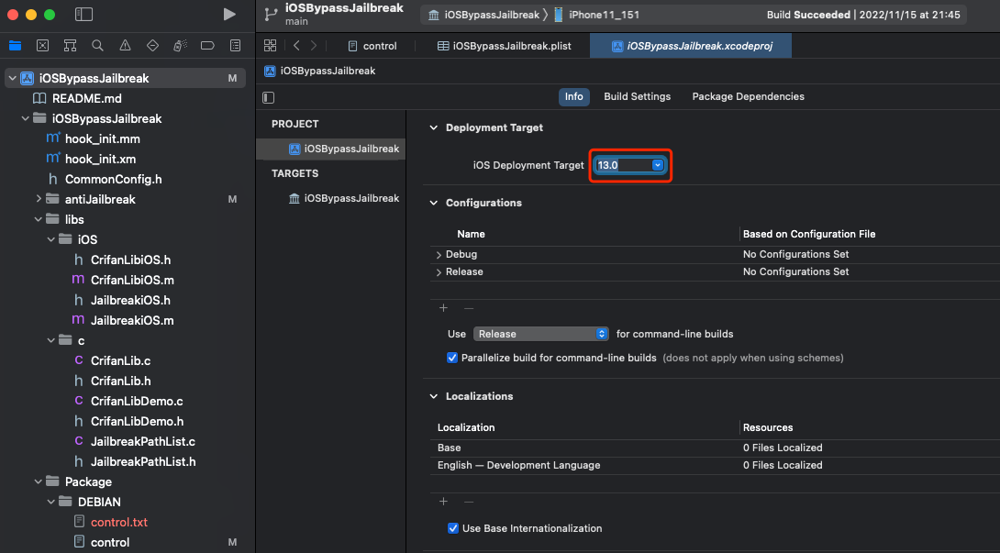
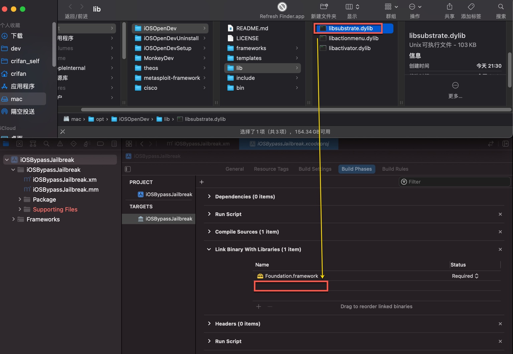
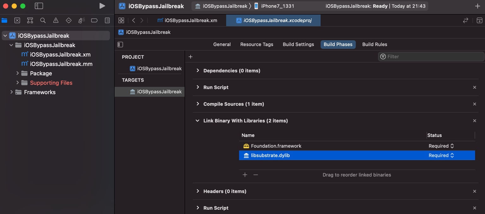
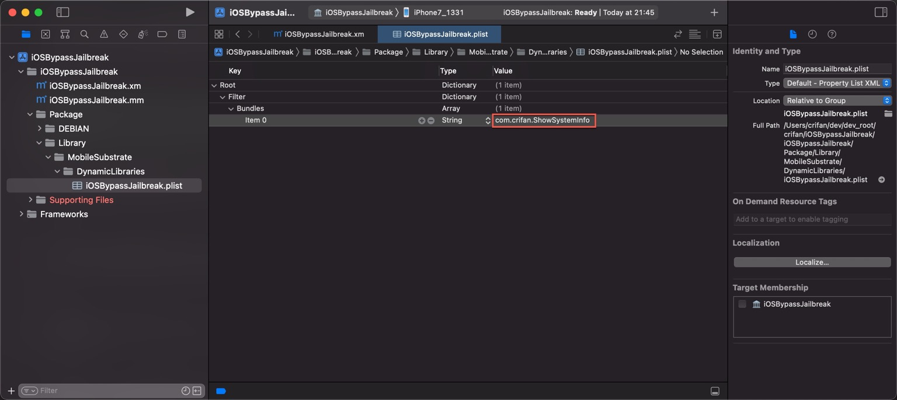
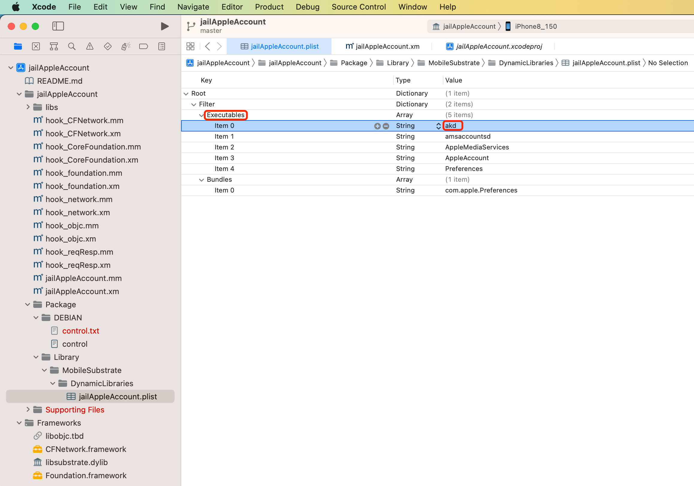
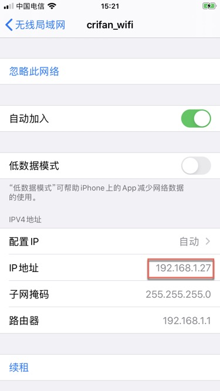
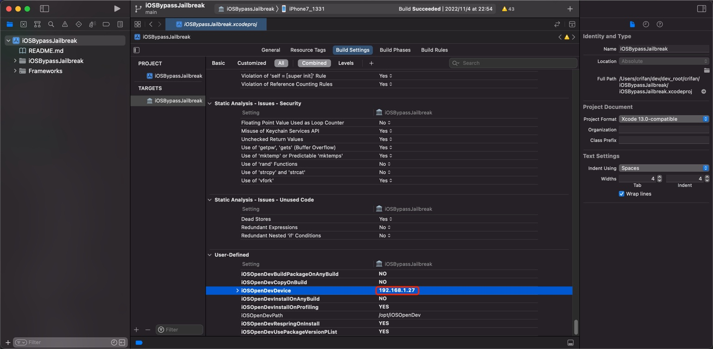

# 初始化配置iOSOpenDev的Xcode项目

## 去掉`Deploymen Info`中的`Mac`

此处，先去做第一个配置方面的改动：

* `TARGETS`->`General`->`Deploymen Info`：去掉`Mac`，因为我们开发的是`iOS`的插件，不需要发布到`Mac`，且设置好iOS的最低版本
  * 
* `PROJECT`->`Info`->`Deployment Target`->`iOS Deployment Target`，也要同步设置`iOS`的最低版本
  * 


### 导入依赖库`libsubstrate.dylib`

把`libsubstrate.dylib`(一般在`/opt/iOSOpenDev/lib/libsubstrate.dylib`)：



导入到项目中的：`Targets`->`YourProjectName`->`Build Phases`->`Link Binary With Libraries`



## 设置被hook的app的包名

去把要hook的，被拦截的app的包名，加到被hook的包名的列表中：

`YourProjectName`->`YourProjectName`->`Package`->`Libarary`->`MobileSubstrate`->`DynamicLibraries`->`CurrentProjectBundleIdentifier.plist`

在`Root`->`Filter`->`Bundles`，会看到`Item 0`：

* `Type`：`String`
* `Value`：填入你要hook的app的包名
  * 举例
    * `com.crifan.ShowSystemInfo`



* 另外
  * 如果要新增一行
    * 移动到`Item 0`所在的行，会看到出现个`➕`=`加号`，点击`加号`，会新增一行

#### 如何hook二进制？

如果需要hook二进制，则是新建`Array`类型的（和`Bundles`并列的）`Executables`子项，再加上对应的二进制文件名

举例：

* hook二进制：`akd` = `AuthKit.framework`的daemon进程
  * 

此时，对应的`plist`文件内容是：

* jailAppleAccount/Package/Library/MobileSubstrate/DynamicLibraries/jailAppleAccount.plist
  ```xml
  <?xml version="1.0" encoding="UTF-8"?>
  <!DOCTYPE plist PUBLIC "-//Apple//DTD PLIST 1.0//EN" "http://www.apple.com/DTDs/PropertyList-1.0.dtd">
  <plist version="1.0">
  <dict>
    <key>Filter</key>
    <dict>
      <key>Executables</key>
      <array>
        <string>akd</string>
        <string>amsaccountsd</string>
        <string>AppleMediaServices</string>
        <string>AppleAccount</string>
        <string>Preferences</string>
      </array>
      <key>Bundles</key>
      <array>
        <string>com.apple.Preferences</string>
      </array>
    </dict>
  </dict>
  </plist>
  ```

## 设置iPhone的IP

把此处要把iOS调试设备（iPhone）中的IP地址：



此处是：`192.168.1.27`

去加到配置中去：

* `iOSOpenDevDevice` = `192.168.1.27`



附上原默认的更新后的配置：

```bash
iOSOpenDevBuildPackageOnAnyBuild = NO
iOSOpenDevCopyOnBuild = NO
iOSOpenDevDevice = 192.168.1.27
iOSOpenDevInstallOnAnyBuild = NO
iOSOpenDevInstallOnProfiling = YES
iOSOpenDevPath = /opt/iOSOpenDev
iOSOpenDevRespringOnInstall = YES
iOSOpenDevUsePackageVersionPList = YES
```

另外，理论上，去把对应变量加到环境变量：

```bash
➜  ~ cat ~/.zshrc | grep iOSOpenDevDevice
export iOSOpenDevDevice=192.168.1.27
```

效果应该也是一样的。

## 确保ssh免密登录iPhone

此处iOSOpenDev内部在调试期间，会自动通过ssh访问iPhone设备，把生成的`.deb`插件的文件下载和安装到iPhone中

此时就需要先准备好环境：确保`Mac`中可以，ssh的免密登录iPhone

此处ssh免密登录的具体步骤是：

* 先用ssh登录一次iPhone
  * 命令
    ```bash
    ssh root@192.168.1.27
    ```
  * 输入密码
    * `OpenSSH`的默认密码是：`alpine`
  * 即可登录到iPhone中
* 把ssh的key拷贝到iPhone中
  * 命令
    ```bash
    ssh-copy-id root@192.168.1.27
    ```
  * 输入密码：`alpine`

即可实现，ssh免密登录：

以后ssh直接可以访问iPhone，而无需输入密码

### 常见问题

如果没有ssh免密登录，则常会看到对应的错误提示：

```bash
Preparing to run Xcode Build Phase...
Signing /Users/crifan/Library/Developer/Xcode/DerivedData/iOSBypassJailbreak-bfqgivvncccwmeaykhtbtvgylkkq/Build/Products/Release-iphoneos/iOSBypassJailbreak.dylib with ldid... Done.
Copying /Users/crifan/Library/Developer/Xcode/DerivedData/iOSBypassJailbreak-bfqgivvncccwmeaykhtbtvgylkkq/Build/Products/Release-iphoneos/iOSBypassJailbreak.dylib to package directory at /Users/crifan/dev/dev_root/crifan/iOSBypassJailbreak/iOSBypassJailbreak/Package/Library/MobileSubstrate/DynamicLibraries...
Preparing to build package...
Setting control file /Users/crifan/dev/dev_root/crifan/iOSBypassJailbreak/iOSBypassJailbreak/Package/DEBIAN/control Version field to 1.0-1 using /Users/crifan/dev/dev_root/crifan/iOSBypassJailbreak/iOSBypassJailbreak/PackageVersion.plist... Done.
Building package ... Done.
Creating zip /Users/crifan/dev/dev_root/crifan/iOSBypassJailbreak/Packages/com.crifan.iOSBypassJailbreak_1.0-1_iphoneos-arm.zip... Done.
Host key verification failed.
Failed to create directory /var/root/iOSOpenDevPackages on device 192.168.1.27
Command PhaseScriptExecution failed with a nonzero exit code
```
