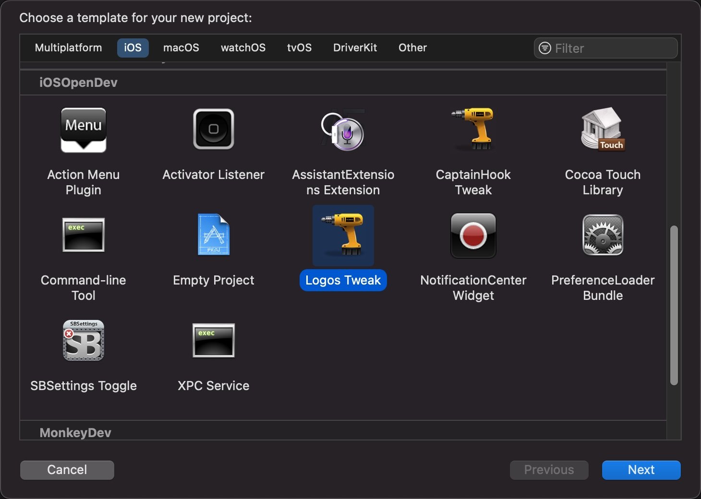
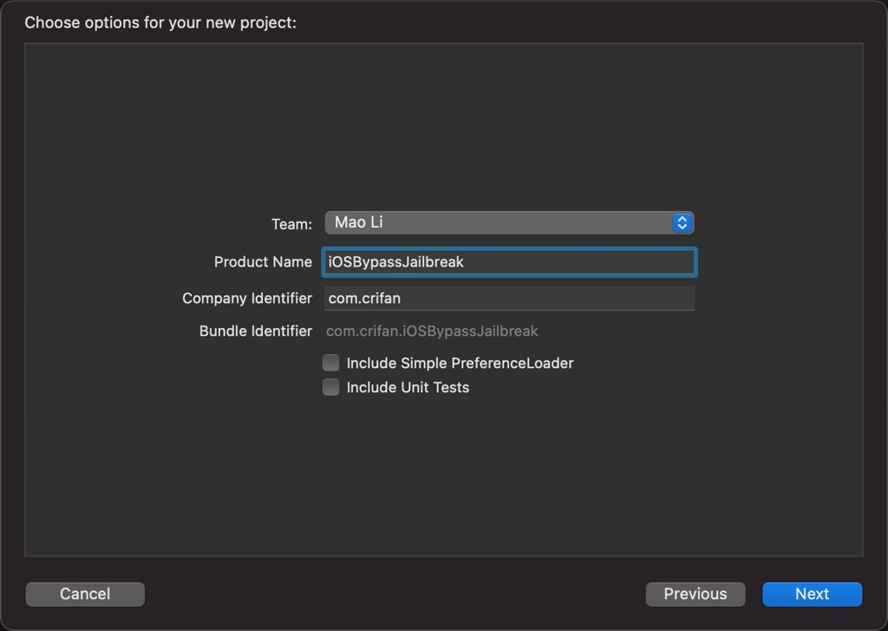
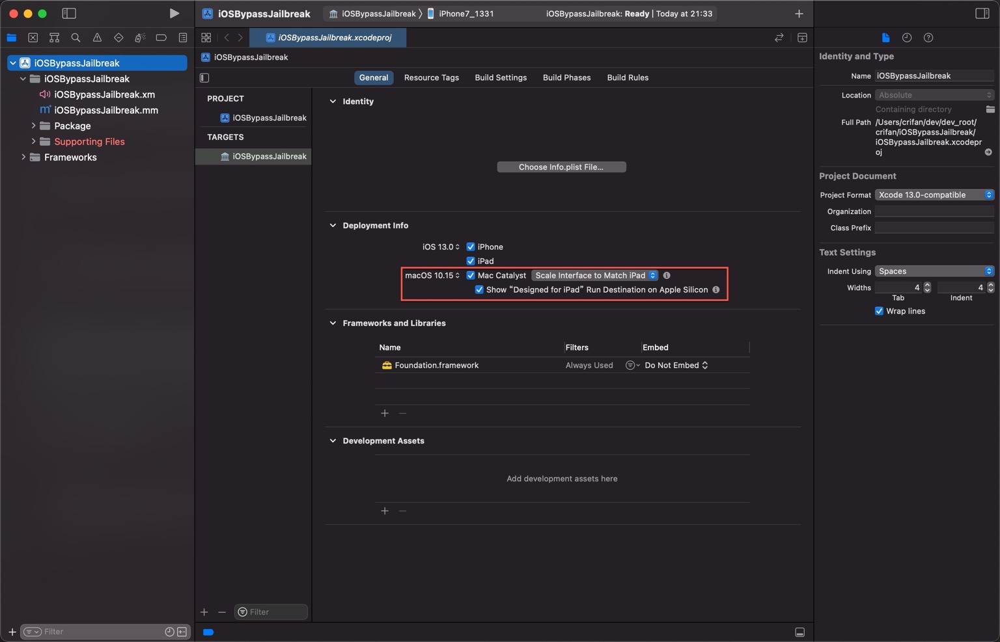

# 新建iOSOpenDev的Xcode项目

`Xcode`中新建`iOS`项目，选择：`iOSOpenDev`->`Logos Tweak`：

然后填写项目信息：

比如[iOSBypassJailbreak](https://github.com/crifan/iOSBypassJailbreak)的：

* `Product Name`: `iOSBypassJailbreak`
* `Company Bundle`: `com.crifan`
* `Bundle Identifier`: 自动生成出 `com.crifan.iOSBypassJailbreak`

点击`Next`继续，即可新建出，看起来和普通`Xcode`没多大区别的项目：

