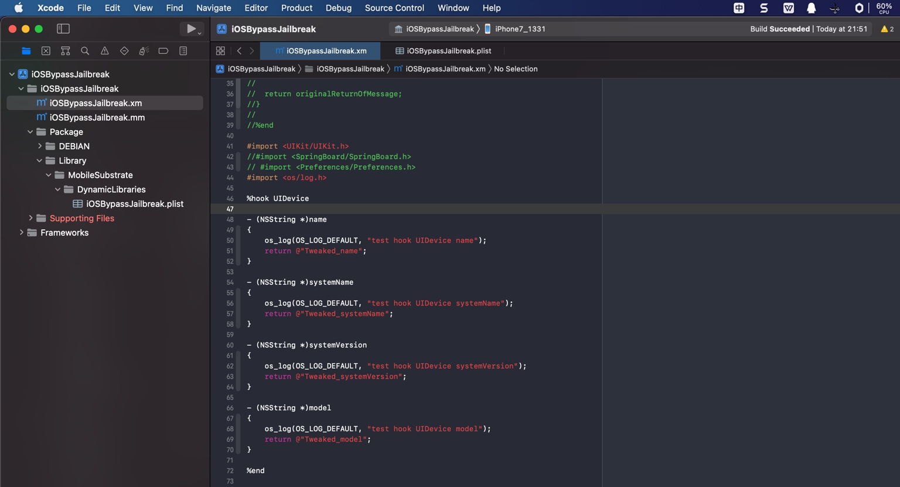

# 写hook插件代码

新建`iOSOpenDev`的项目中的`.xm`文件（此处是`iOSBypassJailbreak.xm`）生成的默认代码，来自模板，一般是：

```c
// Logos by Dustin Howett
// See http://iphonedevwiki.net/index.php/Logos

#error iOSOpenDev post-project creation from template requirements (remove these lines after completed) -- \
   Link to libsubstrate.dylib: \
   (1) go to TARGETS > Build Phases > Link Binary With Libraries and add /opt/iOSOpenDev/lib/libsubstrate.dylib \
   (2) remove these lines from *.xm files (not *.mm files as they're automatically generated from *.xm files)

%hook ClassName

+ (id)sharedInstance
{
   %log;

   return %orig;
}

- (void)messageWithNoReturnAndOneArgument:(id)originalArgument
{
   %log;

   %orig(originalArgument);

   // or, for exmaple, you could use a custom value instead of the original argument: %orig(customValue);
}

- (id)messageWithReturnAndNoArguments
{
   %log;

   id originalReturnOfMessage = %orig;

   // for example, you could modify the original return value before returning it: [SomeOtherClass doSomethingToThisObject:originalReturnOfMessage];

   return originalReturnOfMessage;
}

%end
```

去删除掉，或注释掉，改为自己的hook的代码。

## 附录

### demo示例代码

比如此处仅用于演示的代码：



```c
#import <UIKit/UIKit.h>
//#import <SpringBoard/SpringBoard.h>
// #import <Preferences/Preferences.h>
#import <os/log.h>

%hook UIDevice

- (NSString *)name
{
    os_log(OS_LOG_DEFAULT, "test hook UIDevice name");
    return @"Tweaked_name";
}

- (NSString *)systemName
{
    os_log(OS_LOG_DEFAULT, "test hook UIDevice systemName");
    return @"Tweaked_systemName";
}

- (NSString *)systemVersion
{
    os_log(OS_LOG_DEFAULT, "test hook UIDevice systemVersion");
    return @"Tweaked_systemVersion";
}

- (NSString *)model
{
    os_log(OS_LOG_DEFAULT, "test hook UIDevice model");
    return @"Tweaked_model";
}

%end
```

### iOSOpenDevHookTemplate

关于iOSOpenDev中，对于典型的常见的iOS的ObjC类和其他native的C函数等，如何去写hook代码，可以参考，我已整理出完整的模板项目：

* https://github.com/crifan/iOSOpenDevHookTemplate
  * hook_iOS_ObjC_CommonClass.xm
    * https://github.com/crifan/iOSOpenDevHookTemplate/blob/main/iOSOpenDevHookTemplate/iOSOpenDevHookTemplate/hook_iOS_ObjC_CommonClass.xm
  * hook_iOS_ObjC_specific.xm
    * https://github.com/crifan/iOSOpenDevHookTemplate/blob/main/iOSOpenDevHookTemplate/iOSOpenDevHookTemplate/hook_iOS_ObjC_specific.xm
  * hook_native_misc.xm
    * https://github.com/crifan/iOSOpenDevHookTemplate/blob/main/iOSOpenDevHookTemplate/iOSOpenDevHookTemplate/hook_native_misc.xm
