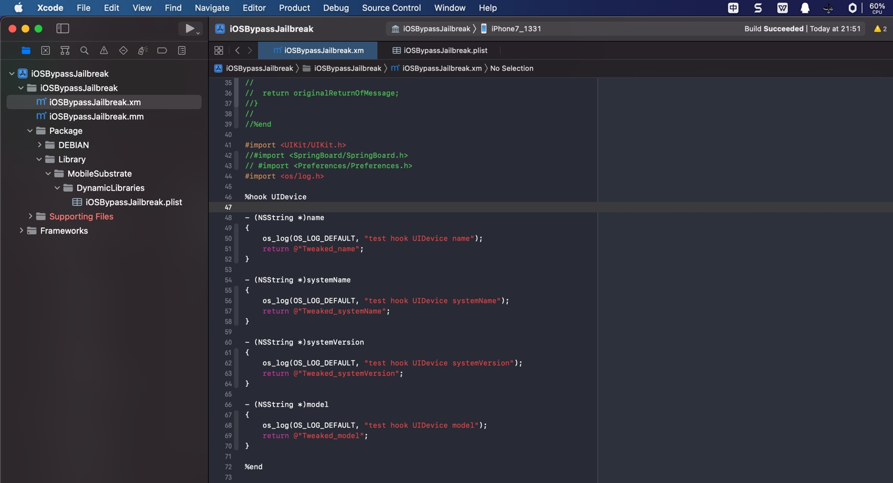
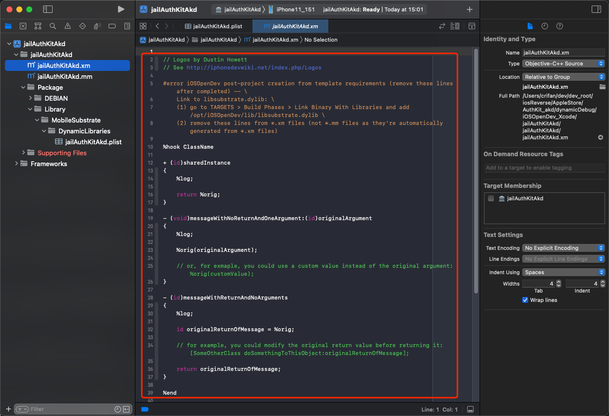

# 写hook插件代码

iOSOpenDev中的hook插件代码的逻辑是：

* `.xm`：原始的hook插件的代码
  * 写hook插件，是改动`.xm`文件
    * 而不需要，也不应该改动`.mm`文件
* `.mm`：从`.xm`自动（在`Buil`d后）自动生成的文件
  * 后续真正编译的文件是`.mm`文件
    * 可以在`Compiled Sources`中看到`.mm`文件（而不是`.xm`文件）

新建`iOSOpenDev`的项目中的`.xm`文件（此处是`iOSBypassJailbreak.xm`）生成的默认代码，来自模板，一般是：

```c
// Logos by Dustin Howett
// See http://iphonedevwiki.net/index.php/Logos

#error iOSOpenDev post-project creation from template requirements (remove these lines after completed) -- \
   Link to libsubstrate.dylib: \
   (1) go to TARGETS > Build Phases > Link Binary With Libraries and add /opt/iOSOpenDev/lib/libsubstrate.dylib \
   (2) remove these lines from *.xm files (not *.mm files as they're automatically generated from *.xm files)

%hook ClassName

+ (id)sharedInstance
{
   %log;

   return %orig;
}

- (void)messageWithNoReturnAndOneArgument:(id)originalArgument
{
   %log;

   %orig(originalArgument);

   // or, for exmaple, you could use a custom value instead of the original argument: %orig(customValue);
}

- (id)messageWithReturnAndNoArguments
{
   %log;

   id originalReturnOfMessage = %orig;

   // for example, you could modify the original return value before returning it: [SomeOtherClass doSomethingToThisObject:originalReturnOfMessage];

   return originalReturnOfMessage;
}

%end
```

去删除掉，或注释掉，改为自己的hook的代码。

比如此处仅用于演示的代码：



```c
#import <UIKit/UIKit.h>
//#import <SpringBoard/SpringBoard.h>
// #import <Preferences/Preferences.h>
#import <os/log.h>

%hook UIDevice

- (NSString *)name
{
    os_log(OS_LOG_DEFAULT, "test hook UIDevice name");
    return @"Tweaked_name";
}

- (NSString *)systemName
{
    os_log(OS_LOG_DEFAULT, "test hook UIDevice systemName");
    return @"Tweaked_systemName";
}

- (NSString *)systemVersion
{
    os_log(OS_LOG_DEFAULT, "test hook UIDevice systemVersion");
    return @"Tweaked_systemVersion";
}

- (NSString *)model
{
    os_log(OS_LOG_DEFAULT, "test hook UIDevice model");
    return @"Tweaked_model";
}

%end
```

## 如何新增(`.xm`和`.mm`)文件

有时候，需要去新增文件：`.xm`和`.mm`

具体步骤是：

* 新建`.xm`文件
  * 选中要新增文件所属的位置 -> 右键 -> `Add File`-> `iOS` -> `Other`->`Empty`->输入文件名：`yourFilename.xm` ->`Create`
* 编译 -> 会生成对应`.mm`文件
  * `Product`->`Build`
    * 会从`yourFilename.xm`生成`yourFilename.mm`
* 把`.mm`文件加到`Compile Sources`中
  * 右键-> `Add Files to {yourProjectName}` -> 选择（刚新生成的)`yourFilename.mm`
    * 项目文件列表中，即可新增对应文件`yourFilename.mm`
    * 项目的待编译的文件中，也包含了对应的`.mm`文件
      * `Targets`->`Build Phase`->`Compile Sources` 中有了刚加入的`.mm`文件
        * 如果文件，点击`加号`=`➕`，去新增导入进来
          * 这样后续编译代码时，才能真正编译到对应hook代码

## 常见问题

### `.xm`被识别为Audio音频文件

* 问题：`iOSOpenDev`的`Xcode`中，默认的`.xm`被识别成**音频**文件，无法显示对应的源代码
  * 具体现象
    * xm的文件的图标是`小喇叭`
    * 且右边显示的是：音乐的图标
    * 右边文件类型Type显示是：`Default - XM audio file`
  * 图
    * 
* 解决办法：
  * 先去：改变.xm的文件类型
    * Xcode右边的文件属性->`Type`，从`Default - XM audio file`改为`Objective-C++ Source`（或`Objective-C Source`）
      * 
  * 再去改变`.xm`的文件的打开方式
    * Xcode左边文件列表->右键`.xm`文件->`Open As`->`Source Code`
      * 
  * 即可正常显示`.xm`为ObjC的代码，并且带语法高亮了，且文件图标是`.m`的图标
    * 
