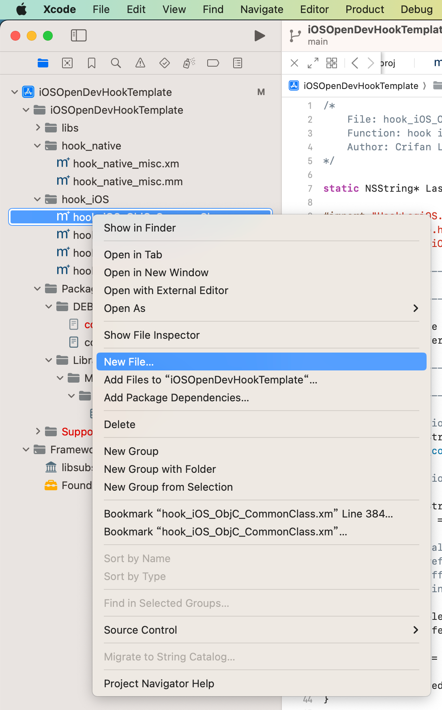
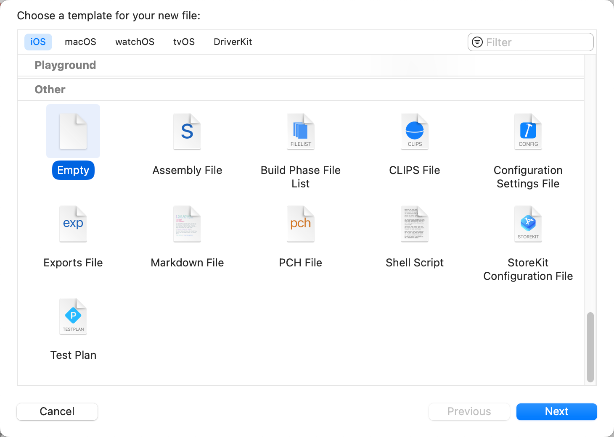
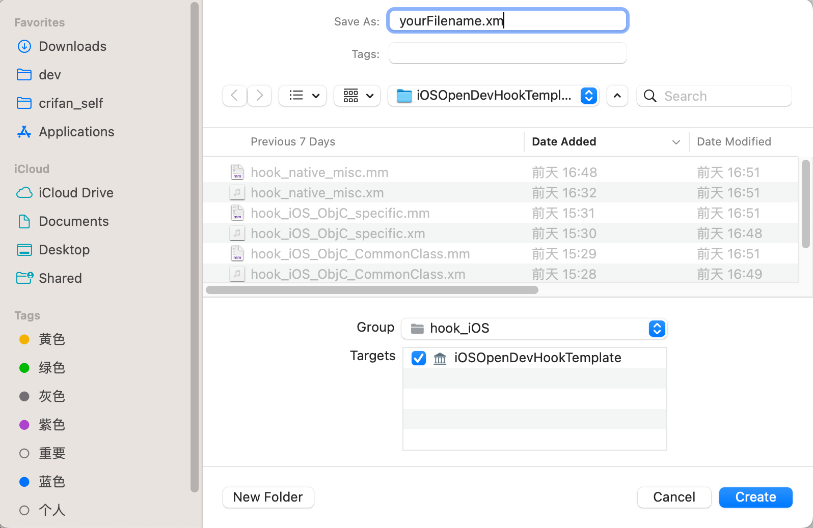
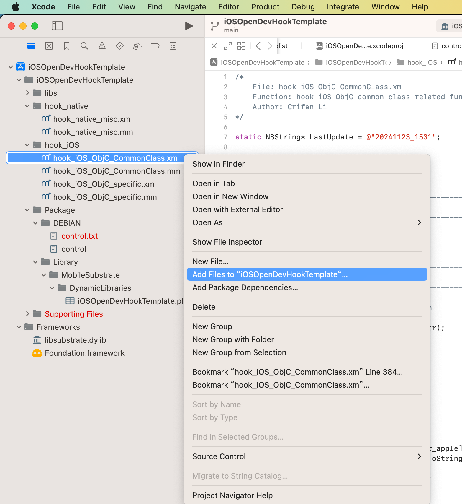
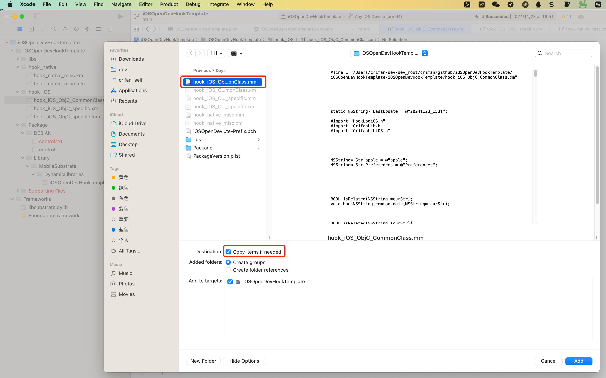
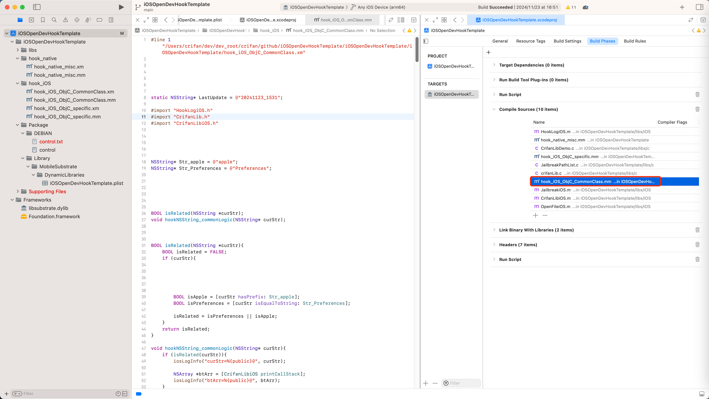

# 如何新增(`.xm`和`.mm`)文件

对于想要新增hook代码逻辑，而去新增`.xm`文件的相关逻辑是：

具体步骤是：

* 新建`.xm`文件
  * `Xcode`->选中要新增文件所属的位置 -> 右键 -> `New File`-> `iOS` -> `Other`->`Empty`->输入文件名：`yourFilename.xm` ->`Create`
    * 
    * 
    * 
  * 此时项目列表中会新增出对应的`.xm`文件
* 编译 -> 会生成对应`.mm`文件
  * 【可选】如果遇到报错，就先Clean几次
    * `Xcode`->`Product`->`Clean Build Folder`
  * （然后再）`Xcode`->`Product`->`Build`
    * 会从`yourFilename.xm`生成`yourFilename.mm`
      * 注：此时Xcode项目中是看不到的，但是文件系统中（比如通过Finder）是可以看到`.mm`文件的
* 把`.mm`文件加到`Compile Sources`中
  * 右键-> `Add Files to {yourProjectName}` -> 选择（刚新生成的）`yourFilename.mm`
    * 
    * 其中勾选：`Copy items if needed`
      * 
    * 项目文件列表中，即可新增对应文件`yourFilename.mm`
  * 项目的待编译的`Compile Sources`文件中，也包含了对应的`.mm`文件
    * `Targets`->`Build Phase`->`Compile Sources` 中有了刚加入的`.mm`文件
      * 
    * 注
      * 如果有需要，也可以通过点击`Compile Sources`中的`加号`=`➕`，去新增导入进来（对应的或其他的`.mm`文件）
        * 这样后续编译代码时，才能真正编译到对应hook代码
