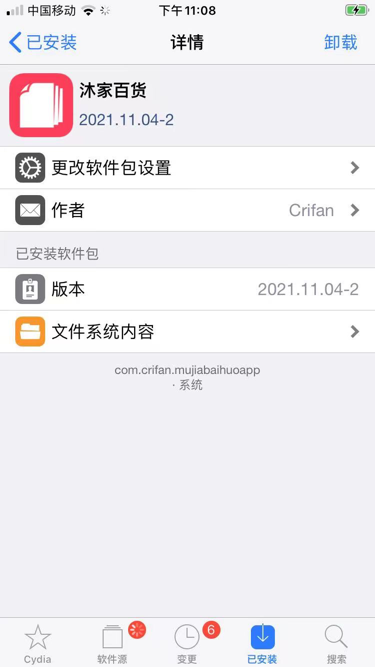
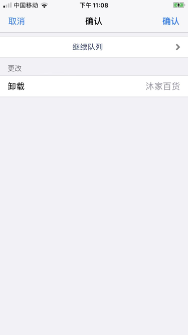

# 心得

TODO：

* 【未解决】XCode调试警告：was compiled with optimization stepping may behave oddly variables may not be available
* 【未解决】iOSOpenDev的XCode的tweak插件编译尝试去掉优化加上调试信息
* 
* 【已解决】iOSOpenDev的XCode调试iPhone6报错：Unable to install The application could not be verified
* 【已解决】XCode中删除掉User-Defined的自定义参数
* 
* 【已解决】iOSOpenDev的XCode的iOS的tweak插件中实现ObjC的通用全局函数
* 【已解决】iOSOpenDev的XCode的iOS插件运行报错：ImageLoaderMachO doModInitFunctions和_logosLocalInit
* 【已解决】iOS代码报错：objc Class is implemented in both app and dylib One of the two will be used Which one is undefined
* 
* 【已解决】iOSOpenDev的XCode项目编译报错：iPhone Developer no identity found
* 【已解决】调试iOSOpenDev的XCode的iOS的app
* 【已解决】研究iOSOpenDev的XCode项目编译过程以确保如何链接自定义.c文件的.o文件
* 【已解决】iOSOpenDev的XCode项目偶尔编译非常慢卡死
* 【已解决】iOSOpenDev的XCode中新增.c和.h文件并正常编译
* 【已解决】如何把XCode的iOS的app项目转换成iOSOpenDev的项目
* 【已解决】对比研究FakeWeChatLoc和自己的XCode项目的目录结构区别
* 【已解决】iOSOpenDev的XCode调试iPhone7报错：Unable to install A system application with the given bundle identifier is already installed on the device and cannot be replaced
* 【记录】更新iOSOpenDev的Logos插件的code signing签名配置
* 【已解决】XCode中iOSOpenDev开发插件代码报错：No matching function for call to strcpy
* 【已解决】XCode中iOSOpenDev的Tweak项目中Build Settings中User-Defined中添加和引用变量THEOS
* 【记录】研究XCode中clang编译mm文件的过程和编译参数
* 【记录】深究为何此处XCode编译strcpy会报错No matching function for call to
* 【未解决】把之前theos的tweak改机剩余功能移植到iOSOpenDev的XCode中
* 

---

## `.xm`文件和`.mm`文件

TODO：

* 【已解决】Xcode中xm源码中无法看到和添加断点
* 【已解决】iOSOpenDev的XCode中.xm文件包含.c中函数找不到报错：Undefined symbols for architecture arm64 referenced from
* 【已解决】XCode的iOSOpenDev项目报错：Failed Logos Processor Could not open xm
* 【已解决】iOSOpenDev的XCode中如何把Tweak的xm代码拆分成多个文件模块
* 【未解决】iOSOpenDev的iosod的bug修复：Logos的预处理不支持group子目录中的xm文件

#### 代码高亮

* 【已解决】iOSOpenDev的XCode中新增xm文件设置为Logos语法高亮但无效
* 【已解决】让XCode的iOSOpenDev中Logos的xm文件支持语法高亮

## iOSOpenDev内部逻辑和过程

TODO：

* 【未解决】研究iOSOpenDev的XCode项目编译过程以确保如何链接自定义.c文件的.o文件
* 【已解决】XCode编译iOSOpenDev的Logo Tweak项目报错： Command PhaseScriptExecution failed with a nonzero exit code Failed to locate Logos Processor
* 【未解决】XCode中编译iOSOpenDev的Logos的Tweak时shell从sh换为zsh
* 【已解决】给iOS的XCode项目中新增iOSOpenDev的Project Navigator的目录和文件
* 【已解决】XCode项目中新增iOSOpenDev的Package目录到Target目录中
* 【已解决】XCode中如何把libsubstrate.dylib动态库导入到Link Binary With Libraries

## 如何卸载带UI的插件app

* 通过Cydia去卸载已安装的（带UI界面的）插件tweak即可

步骤：

`Cydia`->`已安装`->`最近`->找到插件->进入详情页

点击右上角的`卸载`：

即可卸载掉插件。
