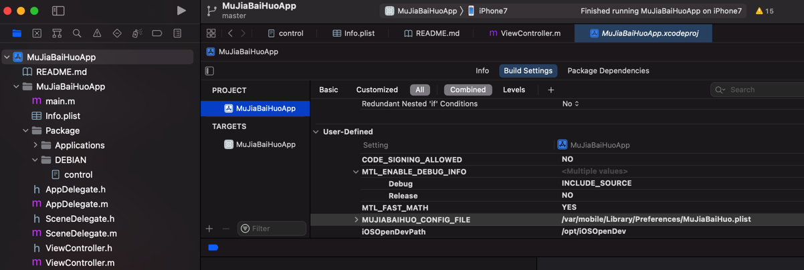
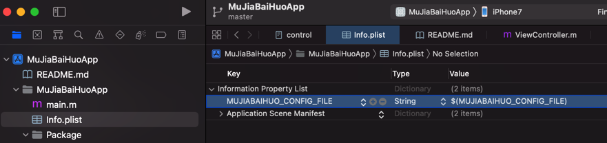
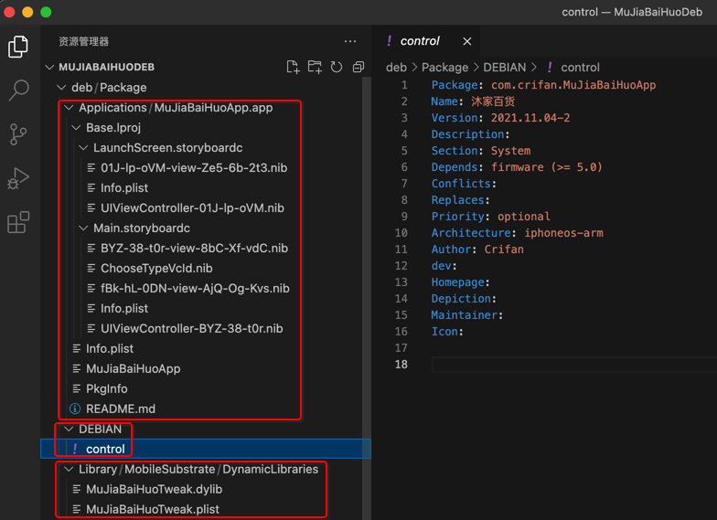
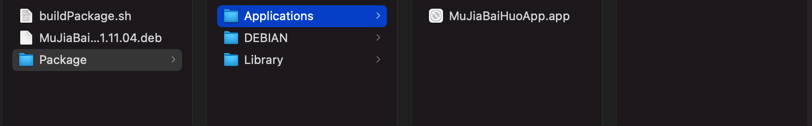
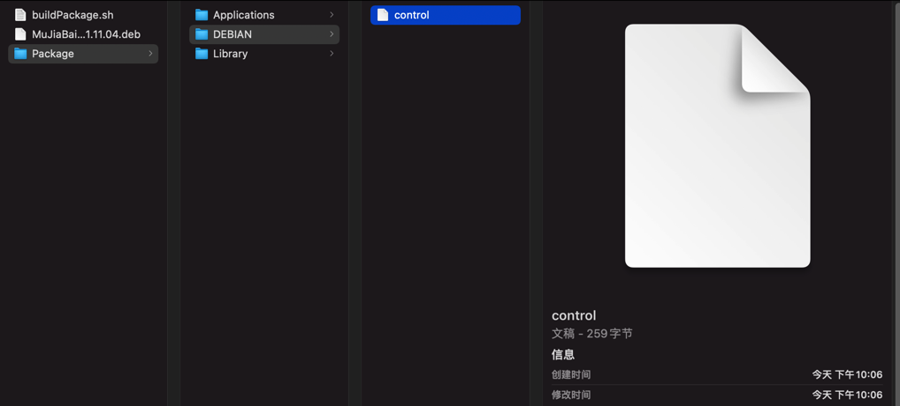
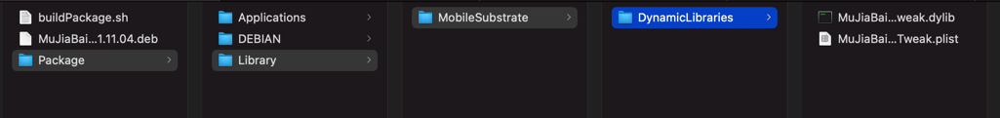
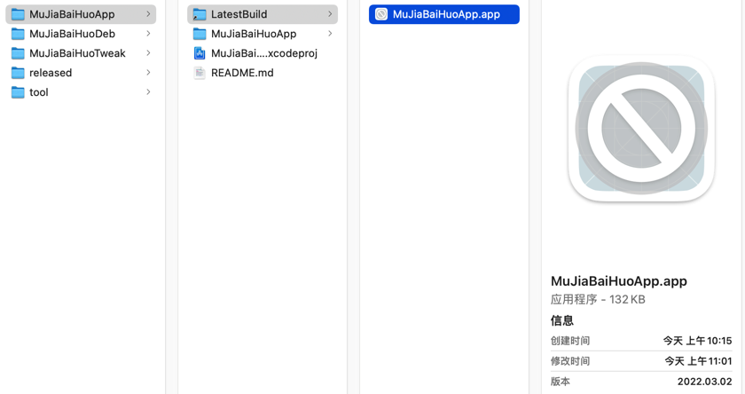
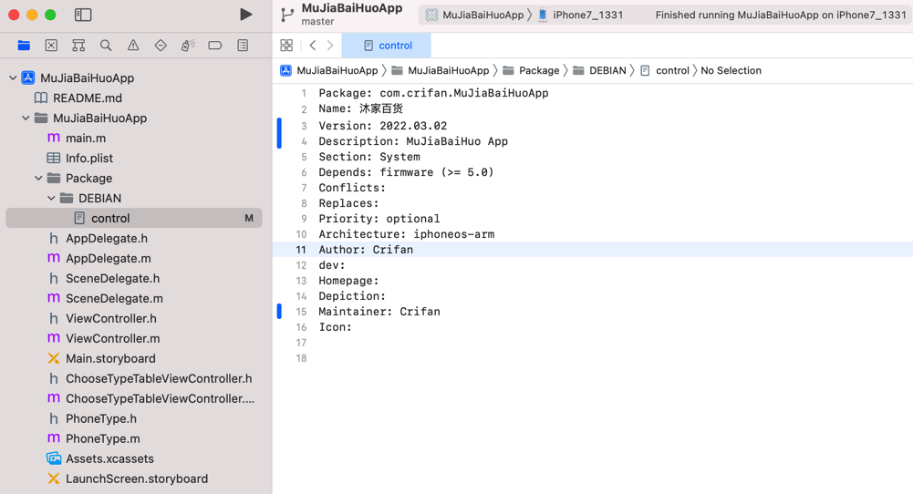
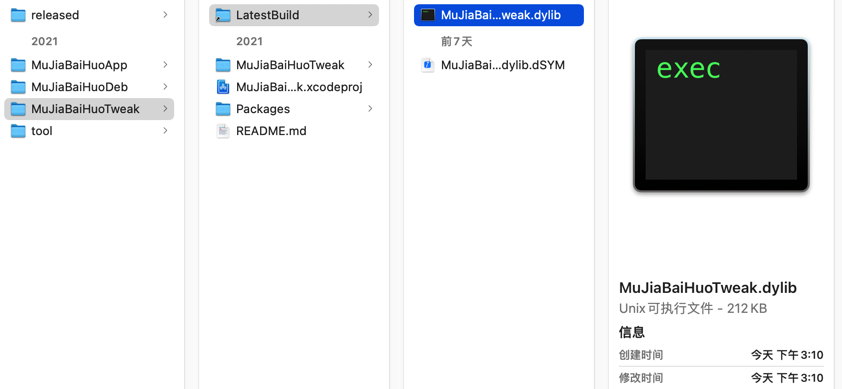
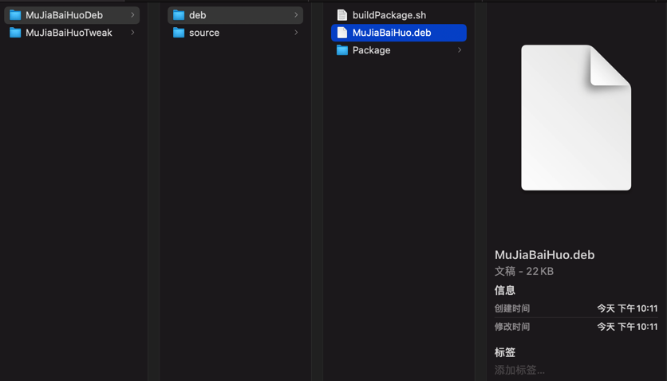

# 基本流程

TODO：

* 【已解决】XCode 13.1中Build Settings中Code Signing Identity没有Don’t Sign Code选项
* 【已解决】XCode中编译设置参数中如何新增User-Defined自定义参数
* 【已解决】XCode项目中新增iOSOpenDev的Package目录到Target目录中

---

## 把Xcode中iOS的app项目转换成iOSOpenDev的项目

把普通的XCode项目，去改造成iOSOpenDev的项目：

核心步骤：

只需参考官网教程：

[Convert to iOSOpenDev Project · kokoabim/iOSOpenDev Wiki (github.com)](https://github.com/kokoabim/iOSOpenDev/wiki/Convert-to-iOSOpenDev-Project)

只是有几个细节，需要更新和补充：

### 最新XCode（13.1）中：Code Signing Identity没有Don’t Sign Code选项

解决办法：给`PROJECT`->`Build Settings`->`User-Defined`->增加参数：

* `CODE_SIGNING_ALLOWED=NO`

详见：

* 【已解决】XCode 13.1中Build Settings中Code Signing Identity没有Don’t Sign Code选项

### 新版XCode中找不到新建User-Defined参数的入口

解决办法：选择`PROJECT`（和 或 `TARGETS`中的某个`target`）->`Build Settings`-》最顶部（和`Basic`、`Customized`、`All`、`Combined`所在的同）一行的最右边有个加号**➕**-》`Add User-Defined Setting`

详见：

* 【已解决】XCode中编译设置参数中如何新增User-Defined自定义参数

### 给Target的目录中新建Package

要点：选中自己项目的`Target`目录-》右键-》`New Group`

即可新建组=Group=子目录

详见：

* 【已解决】XCode项目中新增iOSOpenDev的Package目录到Target目录中

## app和tweak之间的通信

对于iOSOpenDev的app，想要和tweak插件之间通信，主要是互相共享配置参数，此处是通过：**配置文件**

具体做法是：

### app端

`MuJiaBaiHuoApp的ViewController.m`

写入配置：

```objc
- (void) saveConfig:(NSDictionary *) curCfgDict {
    NSLog (@"curCfgDict=%@", curCfgDict);
    NSString *curCfgFile = [[NSBundle mainBundle] objectForInfoDictionaryKey:@"MUJIABAIHUO_CONFIG_FILE"];
    NSLog (@"curCfgFile=%@", curCfgFile);
    NSString *curCfgFileUrl = [NSString stringWithFormat:@"file://%@", curCfgFile];
    NSLog (@"curCfgFileUrl=%@", curCfgFileUrl);
    NSURL *curCfgUrl = [NSURL URLWithString:curCfgFileUrl];
    NSLog (@"curCfgUrl=%@", curCfgUrl);
    NSError *writeErr = NULL;
    BOOL isWriteOk = [curCfgDict writeToURL:curCfgUrl error:&writeErr];
    NSLog(@"isWriteOk=%d", isWriteOk);
    if (isWriteOk == NO){
        NSLog(@"writeErr=%@", writeErr);
    }
}
```

到对应的配置文件：

`/var/mobile/Library/Preferences/MuJiaBaiHuo.plist`

注：

* `MUJIABAIHUO_CONFIG_FILE`是加的`User-Defined`的参数
  * 
  * 且：同时加 `MUJIABAIHUO_CONFIG_FILE=$(MUJIABAIHUO_CONFIG_FILE)` 到`info.plist`，才生效
    * 

### tweak端

`MuJiaBaiHuoTweak的MuJiaBaiHuoTweak.xm`

```objc
const NSString *CONFIG_FILE = @"/var/mobile/Library/Preferences/MuJiaBaiHuo.plist";

- (NSString *)model
{
    os_log(OS_LOG_DEFAULT, "MuJiaBaiHuoTweak hook UIDevice model");
    NSString* hookedModel = @"Tweaked_model";
    NSDictionary *curCfgDict = [[NSDictionary alloc] initWithContentsOfFile:(NSString *)CONFIG_FILE];
    os_log(OS_LOG_DEFAULT, "MuJiaBaiHuoTweak curCfgDict=%{public}@", curCfgDict);
    if (curCfgDict) {
        NSString* phoneIdStr = [curCfgDict objectForKey:@"phoneId"];
        os_log(OS_LOG_DEFAULT, "MuJiaBaiHuoTweak phoneIdStr=%{public}@", phoneIdStr);
        hookedModel = phoneIdStr;
        os_log(OS_LOG_DEFAULT, "MuJiaBaiHuoTweak hookedModel=%{public}@", hookedModel);
    }
    
    os_log(OS_LOG_DEFAULT, "MuJiaBaiHuoTweak return hookedModel=%{public}@", hookedModel);
    return hookedModel;
}
```

即可：

从配置文件中

`/var/mobile/Library/Preferences/MuJiaBaiHuo.plist`

读取出之前保存的`NSDictionary`，获取到参数`phoneId`的值。

## 把tweak和app合并成单个deb文件

此处把：

* **tweak**：的Package包中的Library文件夹
  * 去掉DEBIAN目录
    * 中的control
      * 无需tweak的control
* **app**：的Package的目录中的所有内容
  * Applications
  * DEBIAN
    * control
      * 需要app的control文件

合并到一起后的效果：



对应的目录结构：

```bash
➜  MuJiaBaiHuoDeb tree deb/Package 
deb/Package
├── Applications
│   └── MuJiaBaiHuoApp.app
│       ├── Base.lproj
│       │   ├── LaunchScreen.storyboardc
│       │   │   ├── 01J-lp-oVM-view-Ze5-6b-2t3.nib
│       │   │   ├── Info.plist
│       │   │   └── UIViewController-01J-lp-oVM.nib
│       │   └── Main.storyboardc
│       │       ├── BYZ-38-t0r-view-8bC-Xf-vdC.nib
│       │       ├── ChooseTypeVcId.nib
│       │       ├── Info.plist
│       │       ├── UIViewController-BYZ-38-t0r.nib
│       │       └── fBk-hL-0DN-view-AjQ-Og-Kvs.nib
│       ├── Info.plist
│       ├── MuJiaBaiHuoApp
│       ├── PkgInfo
│       └── README.md
├── DEBIAN
│   └── control
└── Library
    └── MobileSubstrate
        └── DynamicLibraries
            ├── MuJiaBaiHuoTweak.dylib
            └── MuJiaBaiHuoTweak.plist

9 directories, 15 files
```

Finder中的效果：

* Applications
  * 
* DEBIAN
  * 
* Library
  * 

关于目录中的各个文件的详细解释：

* `Package`：要打包的根目录
  * `Applications`
    * `MuJiaBaiHuoApp.app`
      * 拷贝自：iOS的**app**的XCode项目下的LatestBuild
        * LatestBuild中保存了每次最新编译之后的版本
          * 
  * `DEBIAN`
    * `control`
      * 用的是：iOS的**app**的Package/DEBIAN/control，不是iOS的tweak的Package/DEBIAN/control
        * 
  * `Library`
    * `MobileSubstrate`
      * `DynamicLibraries`
        * `MuJiaBaiHuoTweak.dylib`
          * 拷贝自：iOS的**tweak**的XCode项目下的LatestBuild
            * LatestBuild中保存了每次最新编译之后的版本
              * 
        * `MuJiaBaiHuoTweak.plist`
          * 拷贝自iOS的tweak中的`Library/MobileSubstrate/DynamicLibraries`

然后写个shell脚本：

* `buildPackage.sh`

```bash
#!/bin/bash
find ./Package -name ".DS_Store" -depth -exec rm {} \;
dpkg-deb -Zgzip -b Package MuJiaBaiHuo.deb
```

  * 注：其实核心就一句：`dpkg-deb -Zgzip -b Package MuJiaBaiHuo.deb`

去加上可执行权限：

```bash
chmod +x ./buildPackage.sh
```

运行脚本去打包出deb

```bash
./buildPackage.sh
```

* log输出举例
  ```bash
  ➜  20220302 pwd
  /Users/crifan/dev/DevRoot/zry/MuJiaBaiHuo/MuJiaBaiHuoDeb/20220302
  ➜  20220302 ../buildPackage.sh
  dpkg-deb: 正在 'MuJiaBaiHuo.deb' 中构建软件包 'com.crifan.mujiabaihuoapp'。
  ```

即可得到deb插件安装包：`MuJiaBaiHuo.deb`



注：

* 如何安装
  * 通过`Filza`或命令行`dpkg`（命令是`dpkg -i filename.deb`）去安装deb文件，即可安装到iPhone中。
