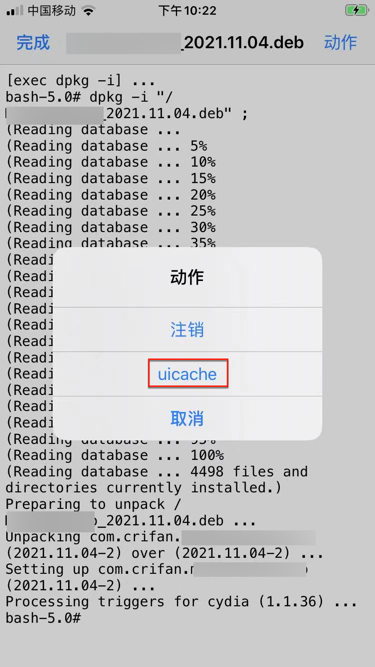

# 常见问题

## 安装插件后桌面上看不到iOS的app图标

* 现象：带UI界面的tweak或app，（通过Filza）安装到iPhone中后，桌面上看不到iOS的app的图标
* 原因：iPhone的UI界面没有刷新=icon图标没有刷新
* 解决办法：
  * 如果是通过Filza安装deb的话
    * Filza的安装完成界面的点击右上角：`动作` -> 选择：`UIcache`
      * 图
        * 
    * 稍等片刻-》桌面上即可出现iOS的app的logo图标了
      * 注：此时点击 `注销`=`Respring`=`重启SpringBoard`，虽然理论上可行，但实际是无效的，无法让桌面出现app图标的
  * 如果不是，则可以单独命令行去运行：`uicache`

## 如何卸载插件

* 通过Cydia去卸载已安装的（带UI界面的）插件tweak即可

步骤：

Cydia->已安装->最近->找到插件->进入详情页

点击右上角的`卸载`：

即可卸载掉插件。
