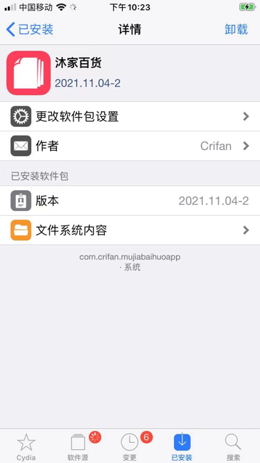
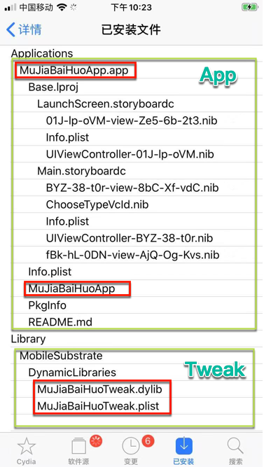
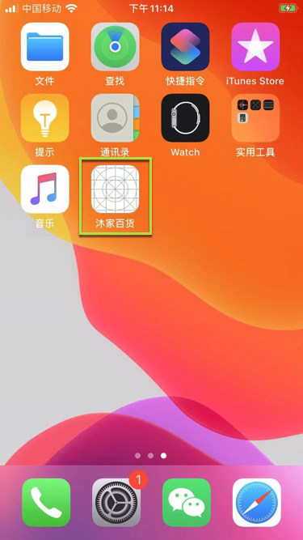
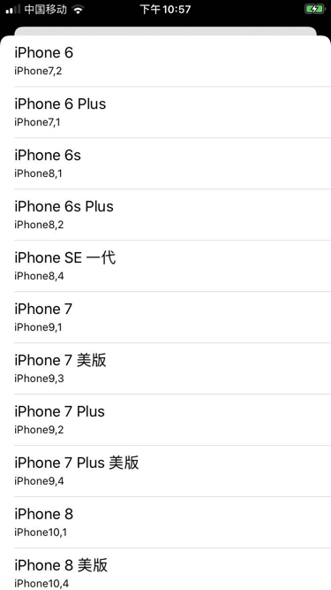
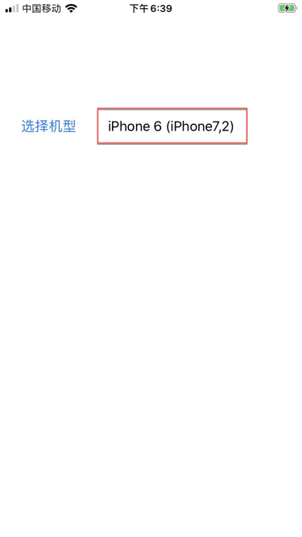
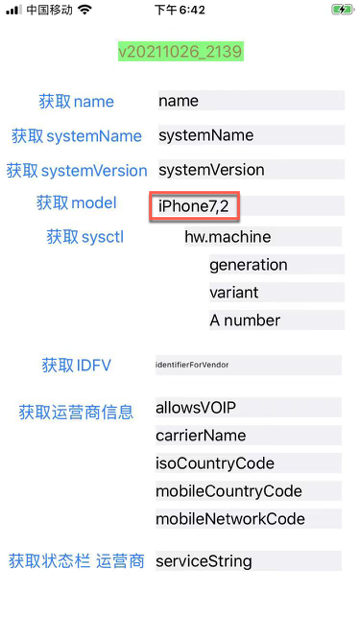
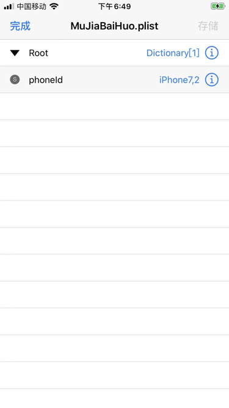

# 使用效果

## 插件安装后的效果

Cydia中可以看到安装后的插件：

其中详情中，点击`文件系统内容`，可以看到包含的详细内容：

其中就有`Applications`和`Library`

## 插件的使用效果

iOS的app部分：

桌面上的Logo=iOS的app的图标：

点击启动后，显示主界面：

点击 选择机型，出现：机型列表

去选择一个：`iPhone 6(iPhone7,2)`

然后回去打开，被hook的普通的iOS的app：`ShowSysInfo`

可以检测当前机型，是我们所hook选择的机型：

-》说明上述的：tweak插件，iOS的app（用于配合插件做配置），是生效的。

注：

对应保存到了配置文件中的内容是：

`phoneId=iPhone7,2`

-》至此，跑通了：

* 带UI界面的tweak插件=单个deb文件，集成了包含了
  * app
    * 实现用户UI界面
    * 选择配置，保存配置到配置文件
      `/var/mobile/Library/Preferences/MuJiaBaiHuo.plist`
  * tweak
    * 实现hook功能
    * 返回的值，根据配置文件中保存的值决定
